# WhatsApp CRM — Engineering Documentation

> Internal engineering reference for the WhatsApp CRM platform.
> Audience: backend, frontend, and platform engineers maintaining or extending the system.
> This document describes **the system as it exists in code today**, not aspirations.
> Limitations sections are deliberately blunt — they exist to make scaling decisions easier.

**Last reviewed:** 2026-05-16. Drift is expected; verify against `git log` when you touch a subsystem.

---

## Table of Contents

1. [System Overview](#1-system-overview)
2. [Realtime Architecture](#2-realtime-architecture)
3. [Messaging System](#3-messaging-system)
4. [Provider Architecture](#4-provider-architecture)
5. [Template System](#5-template-system)
6. [Automation System](#6-automation-system)
7. [Campaign / Broadcast System](#7-campaign--broadcast-system)
8. [Contact & CRM System](#8-contact--crm-system)
9. [Frontend Architecture](#9-frontend-architecture)
10. [Database Architecture](#10-database-architecture)
11. [Security & Permissions](#11-security--permissions)
12. [Current Limitations & Technical Debt](#12-current-limitations--technical-debt)
13. [Future Roadmap](#13-future-roadmap)

---

# 1. System Overview

## 1.1 Purpose

This is a **multi-tenant WhatsApp customer-communication platform**. It supports:

- shared team inbox for WhatsApp conversations
- multi-step automations and keyword bots
- bulk broadcast campaigns with anti-ban pacing
- templates with structured (header / body / footer / buttons) payloads
- CRM primitives (contacts, deals, tasks, tags, internal notes, assignments)
- realtime sync across multiple agents working the same team

It is positioned to be **provider-agnostic** — the Meta Cloud API is the production provider, Baileys exists as a development / fallback transport.

## 1.2 Repository Layout

```
apps/
  backend/          Node.js + Express + Prisma + Socket.IO
    src/
      api/routes/   HTTP endpoints
      auth/         JWT middleware + RBAC
      automations/  Rule engine + multi-step flow executor (Bull)
      broadcasts/   Campaign queue worker (Bull)
      conversations/ Conversation resolver, auto-assign, snooze wake-up
      messaging/    Shared outbound persistence
      providers/    MessagingProvider interface + Meta + Baileys + manager
      realtime/     Socket.IO server + team-scoped emit helpers
      services/     Template rendering + Meta template API
      whatsapp/     Baileys socket lifecycle + sender + status handler
      workflow/     Inbound message processing pipeline
    prisma/         schema.prisma
  frontend/         Next.js 14 (App Router) + NextAuth + socket.io-client
    app/(dashboard) Route group for authenticated dashboard
    components/     UI by domain (conversations, broadcasts, contacts, …)
    hooks/          useSocket helper
    lib/            api client, socket singleton, phone utils
```

## 1.3 Architecture Philosophy

Four guiding principles, enforced unevenly:

1. **Providers are interchangeable.** Features never call Meta or Baileys directly; they go through `providerManager`. The interface is `MessagingProvider` ([apps/backend/src/providers/types.ts](apps/backend/src/providers/types.ts)).
2. **Inbound messages are normalized at the edge.** A single workflow at [apps/backend/src/workflow/inbound-workflow.ts](apps/backend/src/workflow/inbound-workflow.ts) accepts both Baileys socket events and Meta webhook payloads and produces the same internal `NormalizedInboundMessage` shape.
3. **Realtime fan-out is team-scoped.** Every emit must include a `teamId` so events stay isolated per tenant. Global broadcasts are reserved for system events (`wa:status`, `wa:qr`).
4. **Persistence is the source of truth, Socket.IO is a notification channel.** Clients always have to be able to reconcile by refetching — events accelerate, they don't replace.

The philosophy is not uniformly applied — see §12 for the gaps.

## 1.4 High-Level Architecture Diagram

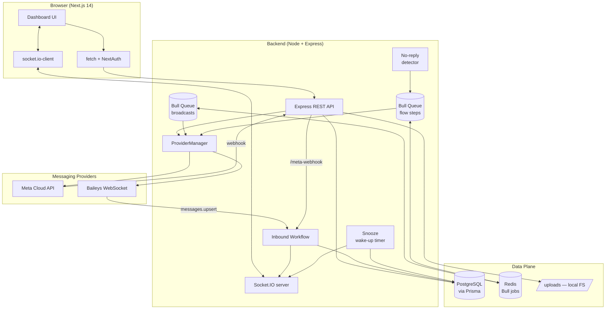

## 1.5 Responsibilities Split

| Concern | Backend | Frontend |
|---|---|---|
| Source of truth | Owns all data via Prisma | Cache via React state — refetches on socket events |
| Auth | Issues JWT (access + refresh), validates per-request | Stores token in localStorage; NextAuth session wraps it |
| Realtime | Emits team-scoped events | Subscribes via `useSocket`; reconciles by refetch when needed |
| Providers | All Meta / Baileys logic | Never talks to WhatsApp directly |
| Permissions | Role check on every protected route | Hides UI affordances by role (defense-in-depth, not security) |
| File uploads | Multer → `/uploads/...` served statically | `apiForm` uploads multipart, displays returned URL |

---

# 2. Realtime Architecture

## 2.1 Server

Single Socket.IO server bound in [apps/backend/src/realtime/socket.ts](apps/backend/src/realtime/socket.ts):

- **Authentication:** middleware reads `socket.handshake.auth.token` (or `Authorization` header), verifies via `jsonwebtoken`, hydrates `socket.data.user` from the DB.
- **Room model:**
  - `team:{teamId}` — every member of a team joins on connect. Default broadcast scope for all messaging events.
  - `user:{userId}` — personal room for direct notifications. Currently unused by code but reserved.
- **Reconnects:** client uses `reconnection: true` with exponential backoff up to 5s. The `auth` field is a callback so the token is re-read on every reconnect.

## 2.2 Emit Helper

```ts
emitRealtime(event, payload, teamId?)
```

- If `teamId` is provided, the event is scoped to `team:{teamId}`.
- If `teamId` is **null/undefined**, the event is broadcast globally.

The global path exists for system events (`wa:status`, `wa:qr`) where there is no tenant context, but it's also a footgun — see §12.

## 2.3 Event Catalog

| Event | Direction | Payload | Emitter |
|---|---|---|---|
| `wa:status` | server → all | `{ status }` | Baileys client lifecycle |
| `wa:qr` | server → all | `{ qr }` | Baileys QR refresh |
| `message:new` | server → team | `{ conversationId, message, isNewContact? }` | inbound workflow / outbound persistence |
| `message:status` | server → team | `{ messageId, conversationId, status }` | Baileys receipts / Meta status webhook |
| `message:reaction` | server → team | `{ conversationId, messageId, reactions[] }` | conversation reaction route / inbound reaction handler |
| `conversation:updated` | server → team | `{ conversationId, lastMessageAt, lastMessagePreview, unreadCount?, ... }` | inbound workflow / status mutations / snooze wake-up |
| `broadcast:progress` | server → team | `{ broadcastId, sent, failed, total }` | broadcast queue worker (every recipient) |
| `broadcast:complete` | server → team | `{ broadcastId, sent, failed, total, status }` | broadcast queue worker (terminal) |
| `typing:start` / `typing:stop` | client → server → other team members | `{ conversationId, userId }` | chat input handler |

## 2.4 Inbound Realtime Flow

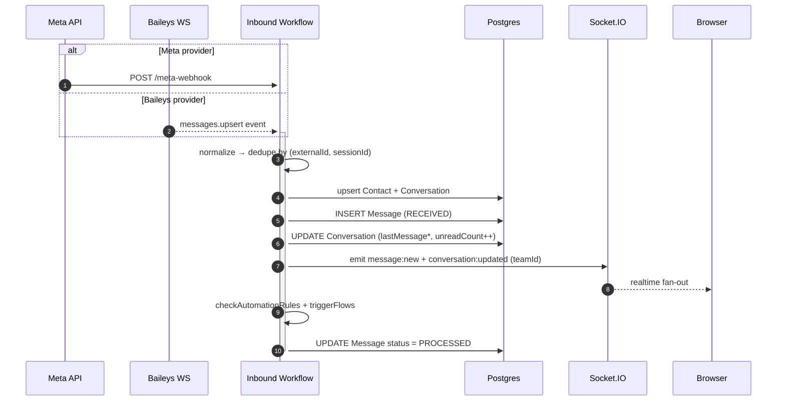

## 2.5 Outbound Realtime Flow (Optimistic UX)

The frontend does **not** currently render optimistically — it waits for `message:new` to arrive via socket *or* refetches the conversation. The backend always:

1. Calls `providerManager.sendMessage(...)`.
2. The provider implementation persists the message (via `persistOutboundMessage` for Meta, inline for Baileys) and emits `message:new` and `conversation:updated`.
3. The originating client receives the event the same way every other team member does.

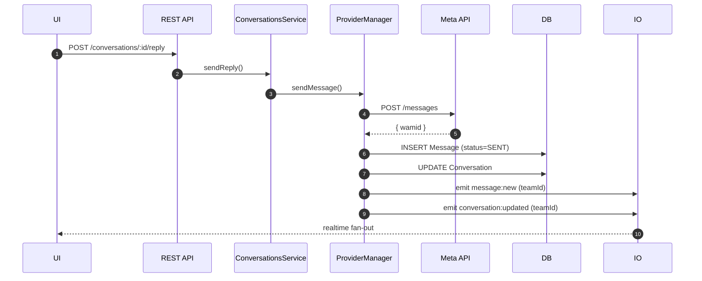

## 2.6 Status Reconciliation (Ticks)

Both providers feed into [apps/backend/src/whatsapp/handler.ts](apps/backend/src/whatsapp/handler.ts):

- Baileys: `messages.update` + `message-receipt.update` events get normalized to `{1 = SENT, 2 = DELIVERED, 3 = READ}`.
- Meta: webhook `statuses[].status` strings (`sent` / `delivered` / `read`) are mapped to the same numeric range in [apps/backend/src/providers/meta-webhook.handler.ts:5](apps/backend/src/providers/meta-webhook.handler.ts#L5) before being passed in.
- `handleMessageStatusUpdates` looks up all messages by `externalId`, updates `status` + `deliveredAt` / `readAt`, then emits `message:status` per affected conversation.

## 2.7 Known Realtime Weaknesses

| Issue | Where | Impact |
|---|---|---|
| **No optimistic send** | Frontend waits for `message:new` to render its own outbound message. | Visible latency on slow links; UI feels less snappy than WhatsApp Web. |
| **Global emits on unknown teamId** | [`emitRealtime`](apps/backend/src/realtime/socket.ts) falls back to `socketServer.emit` when `teamId` is null. | Cross-tenant leakage risk if any code path forgets to pass `teamId`. |
| **Meta async `failed` status ignored** | `mapStatus` in [meta-webhook.handler.ts:5-12](apps/backend/src/providers/meta-webhook.handler.ts#L5-L12) returns `undefined` for `failed`. | A `131047` re-engagement failure leaves the message stored as `SENT` forever. |
| **No event ordering guarantees** | `message:new` and `conversation:updated` are separate emits with no sequence number. | A late-arriving `conversation:updated` can overwrite a fresher state. |
| **Reconnect storm risk** | Server emits `wa:status: connecting/disconnected` on every Baileys reconnect attempt. Reconnect backoff is 3s. | If Baileys flaps, every team gets spammed. |
| **No backpressure** | Socket.IO emits are best-effort; no acknowledgement of delivery. | A client that misses an event must rely on refetch — fine for inbox, dangerous for status. |
| **Race in `unreadCount`** | Two near-simultaneous inbound messages each `increment: 1` on Postgres, but the emitted payload contains `conversation.unreadCount + 1` (pre-update value) which can desync from DB. | Counter mismatch between socket payload and DB reads. |

---

# 3. Messaging System

## 3.1 Canonical Message Shape

The Prisma `Message` model is the canonical record. Every other layer should produce or consume this shape (see §10 for full schema):

```
externalId   — provider-issued ID (wamid for Meta, Baileys key.id)
sessionId    — for Meta: phone_number_id. For Baileys: jid string from sock.user.id
direction    — INBOUND | OUTBOUND
fromMe       — same info as direction; kept for compat
type         — TEXT | IMAGE | DOCUMENT | AUDIO | VIDEO | INTERACTIVE
body         — text body or preview for media
mediaUrl     — local path under /uploads/... OR `meta-media://{mediaId}` for Meta (not yet downloaded)
status       — RECEIVED → PROCESSED (inbound) | SENT → DELIVERED → READ (outbound) | FAILED
@@unique([externalId, sessionId])
```

The `@@unique([externalId, sessionId])` constraint is the **idempotency key for inbound dedup**. The workflow checks this before insert; on duplicate it returns `status: 'duplicate'`.

## 3.2 Inbound Normalization

Both transports converge in [`processIncomingMessage`](apps/backend/src/workflow/inbound-workflow.ts#L459).

**Baileys path** (`normalizeSocketMessage`):
- Skips broadcasts (`@broadcast`) and groups (`@g.us`).
- Unwraps `ephemeralMessage`, `viewOnceMessage`, `viewOnceMessageV2`, `documentWithCaptionMessage` containers.
- Reactions (`reactionMessage`) are split out and routed to `handleIncomingReaction`.
- Protocol-only messages (`protocolMessage`, `senderKeyDistributionMessage`, `messageContextInfo`) are flagged ignorable.
- Falls back to `extendedTextMessage.text`, `*.caption`, etc. for body extraction.

**Meta path** (`buildInboundPayload` in [meta-webhook.handler.ts](apps/backend/src/providers/meta-webhook.handler.ts)):
- Branches per `message.type` ∈ `text|image|video|audio|document|sticker|button|interactive|reaction`.
- For media, stores a sentinel `meta-media://{mediaId}` URL — actual binary download is *not* implemented yet.

Both paths produce the same internal shape and feed `processIncomingMessage`, which is the only place that touches the DB for inbound writes.

## 3.3 Message Lifecycle Diagram

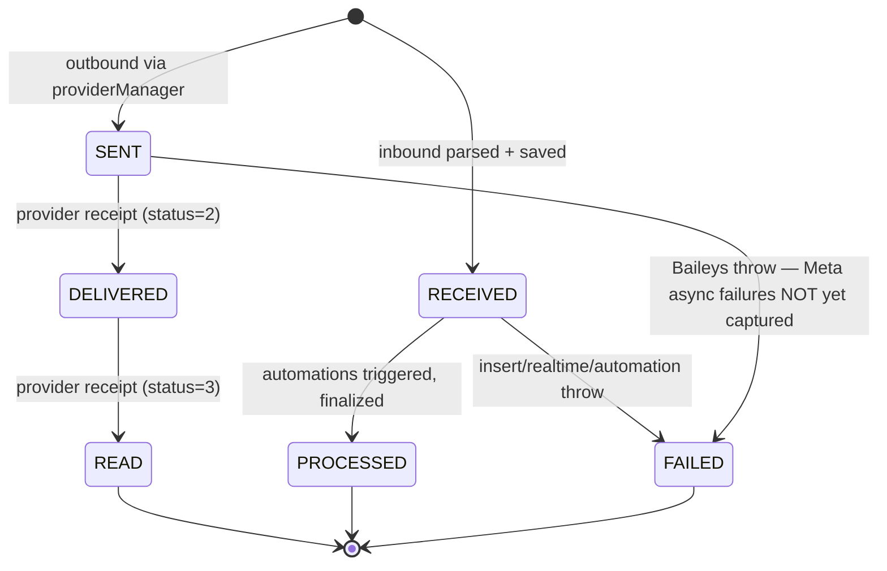

## 3.4 Outbound Flow

There is **one** public entry point: `providerManager.sendMessage({ phone, text?, media?, replyTo? })`.

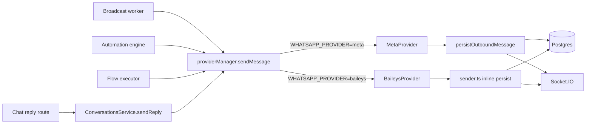

Two different persistence paths is an inconsistency — see §12.

## 3.5 Interactive & Rich Messages

The DB has `MessageType.INTERACTIVE`, but rendering and round-tripping is partial:

- **Inbound:** Meta `interactive` and `button` types are flattened to text-equivalent `body` via `buildInboundPayload`. The original button payload is **lost**.
- **Outbound:** the provider `SendMessageInput` shape has no interactive button support yet — only text and media. The frontend template builder produces a rich `payload` JSON but it is converted to plain text via `blocksToText()` in [ChatWindow.tsx:121](apps/frontend/components/conversations/ChatWindow.tsx#L121) before being sent.
- **Templates:** the `MessageTemplate.payload` field stores Meta-shaped `components` JSON for template approval, but ad-hoc sends still render to text.

This is the largest functionality gap in the messaging system.

## 3.6 Reply / Quote Handling

- Inbound reply context from Meta is set via the `context.message_id` field in the API payload.
- Outbound replies look up the original message's `externalId` to populate `context` (Meta) or build a `quoted` envelope (Baileys, in [sender.ts:162-188](apps/backend/src/whatsapp/sender.ts#L162-L188)).
- The DB stores `replyToId` + `replyToBody` for UI rendering without needing a JOIN.

## 3.7 Media

- **Inbound (Baileys):** binary is downloaded via `downloadMediaMessage`, persisted under `apps/backend/uploads/whatsapp/`, served via Express static. 15 s timeout — on failure, the raw Baileys URL/`directPath` is stored as a fallback.
- **Inbound (Meta):** **only the media ID** is stored (`meta-media://{id}`). The binary fetch from `graph.facebook.com/{id}` is **not yet implemented**. Anything the UI tries to render will 404. This is the #1 bug blocking full Meta migration.
- **Outbound (Meta):** upload via the Graph API `/media` endpoint, then send by `id`. Done in [meta.provider.ts:35-50](apps/backend/src/providers/meta.provider.ts#L35-L50).
- **Audio normalization:** Baileys outbound audio is transcoded to `audio/ogg; codecs=opus` via bundled `ffmpeg-static` because that is the only format WhatsApp renders inline as a voice note.

## 3.8 Provider Differences

| Concern | Meta | Baileys |
|---|---|---|
| Session model | Stateless HTTPS calls | Persistent WebSocket via `auth_info_baileys/` |
| Identity | `phone_number_id` | `sock.user.id` JID |
| Connect | Validates token via `/{id}?fields=display_phone_number` | QR pairing or restored creds |
| Inbound | Webhook `POST /meta-webhook` | `messages.upsert` socket event |
| Receipts | Webhook `statuses[]` | `messages.update` + `message-receipt.update` |
| 24-hour window | Enforced — text outside window fails as `131047` | Not enforced |
| Templates | Approved via `/message_templates` API | None — templates are sent as plain text |
| Media inbound | Two-step (webhook → fetch) — **not implemented** | One-step (binary stream from socket) |
| Failure mode | HTTP 2xx then async webhook status | Throws synchronously |

## 3.9 Limitations

- **Outbound interactive messages aren't supported by the provider interface.** The template builder builds rich content; the send path strips it.
- **Meta failed-delivery webhooks are silently dropped.** A user sees the message as SENT even if Meta rejected it (e.g. `131047`).
- **Baileys still runs even when Meta is primary**, so inbound messages can arrive via both paths. Deduplication is based on `(externalId, sessionId)` — and the `sessionId` differs between Meta (`phone_number_id`) and Baileys (`jid`), so duplicates are possible if both providers are connected to the same business line.
- **Reactions storage is by `(messageId, userId)`** with a UNIQUE constraint — but `userId` is nullable for contact reactions, so two contacts reacting to the same message can collide on `(messageId, null)` if not careful (the code uses `findFirst` workaround).

---

# 4. Provider Architecture

## 4.1 Why Abstract

The system originally talked to Baileys directly from every feature. The abstraction:

- decouples feature code from the transport
- makes Meta vs Baileys a config flip (`WHATSAPP_PROVIDER=meta|baileys`)
- enables future providers (Twilio, 360Dialog, Evolution) without rewriting the CRM
- centralizes failover logic in one place

## 4.2 Interface

`MessagingProvider` in [apps/backend/src/providers/types.ts](apps/backend/src/providers/types.ts):

```ts
interface MessagingProvider {
  readonly name: ProviderName;
  connect(): Promise<void>;
  disconnect(): Promise<void>;
  getStatus(): ProviderStatus;
  sendMessage(input: SendMessageInput): Promise<{ messageId: string }>;
  sendReaction(phone, externalId, fromMe, emoji): Promise<void>;
  getProfilePictureUrl(phone): Promise<string | null>;
}
```

The interface is intentionally narrow — it covers the 90 % case (text + media + reactions). Anything richer (interactive buttons, list messages, location pins) is provider-private right now.

## 4.3 Manager

[`ProviderManager`](apps/backend/src/providers/manager.ts) is a module-singleton constructed once at import time.

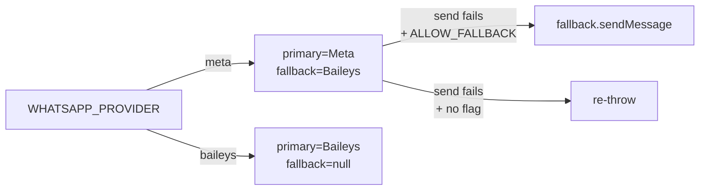

Key behaviors:

- Primary picked from `WHATSAPP_PROVIDER` at boot.
- Fallback (`BaileysProvider`) is constructed and `connect()`-ed in the background so it is warm when needed.
- `sendMessage` tries primary; on throw, logs `provider.primary_send_failed`. If `WHATSAPP_ALLOW_FALLBACK=true`, retries via fallback; otherwise re-raises so the real Meta error surfaces.
- `getStatus` proxies to the primary only — there is no merged view.

## 4.4 Meta Provider

[apps/backend/src/providers/meta.provider.ts](apps/backend/src/providers/meta.provider.ts)

- Uses Graph API v21.0.
- `connect()` validates the token by fetching `display_phone_number`; if validation fails, it proceeds anyway because the env config exists (warning-only).
- `sendMessage`:
  - Builds a `text` payload by default.
  - For media, uploads via `/{phoneNumberId}/media` (multipart) and references by `id`. Also accepts pre-uploaded URLs via `media.url`.
  - Returns `wamid` from the response.
  - Persists via shared `persistOutboundMessage` ([apps/backend/src/messaging/persist-outbound.ts](apps/backend/src/messaging/persist-outbound.ts)).
- `sendReaction` posts a `reaction` payload.
- `getProfilePictureUrl` returns `null` — Meta does not expose this.

## 4.5 Baileys Provider

[apps/backend/src/providers/baileys.provider.ts](apps/backend/src/providers/baileys.provider.ts)

A thin shim over the legacy `whatsapp/sender.ts` and `whatsapp/client.ts` modules. The shim translates between `SendMessageInput` and the legacy `media: { mediaBuffer, mediaMimeType, ... }` shape.

The legacy sender does *not* go through `persistOutboundMessage` — it writes to the DB and emits Socket.IO events inline. See §12 for why this matters.

## 4.6 Failover Logic

Failover is **opt-in** and minimal by design. Two states:

- `WHATSAPP_ALLOW_FALLBACK=true` — on primary error, fallback is tried once. No retries, no health-tracking.
- Otherwise — primary errors propagate.

There is no automatic provider switching based on health; failover is per-send.

## 4.7 Webhook Architecture

Meta webhooks have two endpoints in [apps/backend/src/api/routes/whatsapp.routes.ts](apps/backend/src/api/routes/whatsapp.routes.ts):

- `GET /api/whatsapp/meta-webhook` — verification handshake. Checks `hub.verify_token` against `META_WEBHOOK_VERIFY_TOKEN`.
- `POST /api/whatsapp/meta-webhook` — receives events. Body must have `object = 'whatsapp_business_account'`. Dispatches to `handleMetaWebhook` which fan-outs to `processIncomingMessage` per message and `handleMessageStatusUpdates` for receipts.

The legacy Baileys path uses a separate `POST /api/whatsapp/webhook` guarded by `x-webhook-secret` — used during the transition for ingestion from external sources.

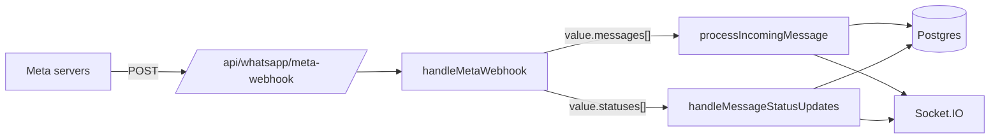

## 4.8 Provider Limitations

- **No capability advertisement.** The interface doesn't declare what each provider supports (templates? buttons? reactions?). Features assume "everything works", which is false for Baileys templates.
- **No connection pooling for Meta.** Every send creates a fresh fetch. Fine at current volume.
- **Status proxied from primary only.** If Meta is offline and Baileys is up, `/api/whatsapp/status` still reports Meta's state.
- **Manager is a module singleton.** Cannot run with two configurations in the same process (e.g., for tests).

## 4.9 Adding a New Provider

1. Implement `MessagingProvider` in `apps/backend/src/providers/<name>.provider.ts`.
2. Use `persistOutboundMessage` for the write path so the rest of the system gets identical realtime events.
3. Normalize inbound events into the `NormalizedInboundMessage` shape and call `processIncomingMessage`.
4. Add an enum branch in `ProviderManager` constructor.
5. Expand `ProviderName` in types.ts.

That's it — features don't need to change.

---

# 5. Template System

## 5.1 Two Worlds

The template system tries to serve two incompatible audiences:

1. **Meta Cloud API templates** — strict schema, must be pre-approved, only certain components allowed.
2. **Rich in-house templates** — drag-and-drop builder with promo cards, product cards, reminders, FAQ blocks — used for ad-hoc sends and saved replies.

Both live in the same `MessageTemplate` model. The distinguishing fields are `metaTemplateId` + `metaStatus`.

## 5.2 Schema

```
MessageTemplate {
  name, content, mediaUrl       — legacy / display
  type     TEXT|MEDIA|INTERACTIVE
  status   DRAFT|PUBLISHED|ARCHIVED  — internal lifecycle
  language, category            — Meta fields
  metaTemplateId, metaStatus    — Meta sync state (PENDING|APPROVED|REJECTED|PAUSED|DELETED)
  payload  Json                 — structured component list
  variables Json                — ordered variable names: ["name","order_id"] → {{1}},{{2}}
}
```

## 5.3 Builder

[apps/frontend/app/(dashboard)/templates/builder/page.tsx](apps/frontend/app/(dashboard)/templates/builder/page.tsx) is a block-based composer. Block types:

- `text` (with style: title / body / footer)
- `buttons` (reply / url / call)
- `media` (image / video / document)
- `promo` (title + description + CTA + image)
- `product` (name + price + image + button)
- `reminder` (title + datetime + confirm/reschedule buttons)
- `support` (greeting + FAQ list)

The builder produces a `payload` JSON that the backend stores untouched.

## 5.4 Meta Submission

[apps/backend/src/services/meta-template.service.ts](apps/backend/src/services/meta-template.service.ts)

- `submit(templateId)` — POSTs to `/{wabaId}/message_templates` with `{ name, language, category, components }`. The `components` is whatever the builder stored in `payload`. **No validation** that the payload matches Meta's strict schema — submission can fail with cryptic errors.
- `syncFromMeta()` — pulls all templates from the WABA and upserts. Maps `APPROVED` → `PUBLISHED`, `REJECTED|DELETED|DISABLED|PAUSED` → `ARCHIVED`.
- `send(phone, templateId, variables)` — only fires if `metaStatus === APPROVED`. Builds parameters from `template.variables` (ordered names) and the runtime variables map.
- `deleteFromMeta(templateId)` — calls Meta DELETE and marks local row as `DELETED`/`ARCHIVED`.

## 5.5 Rendering

Two completely separate renderers:

| Renderer | Where | Output |
|---|---|---|
| `renderTemplate` | [services/template.service.ts](apps/backend/src/services/template.service.ts) | Deep-replaces `{{var}}` in both `content` (string) and `payload` (JSON). Returns `{ text, payload, mediaUrl, variables }`. |
| `blocksToText` | [ChatWindow.tsx:121](apps/frontend/components/conversations/ChatWindow.tsx#L121) | Flattens the rich payload to a single plain-text message with emojis as visual cues. |

The browser preview in the builder renders the structured payload visually, but the actual *send* path produces only flattened text. **Preview ≠ what the recipient sees** — see §12.

## 5.6 Flow

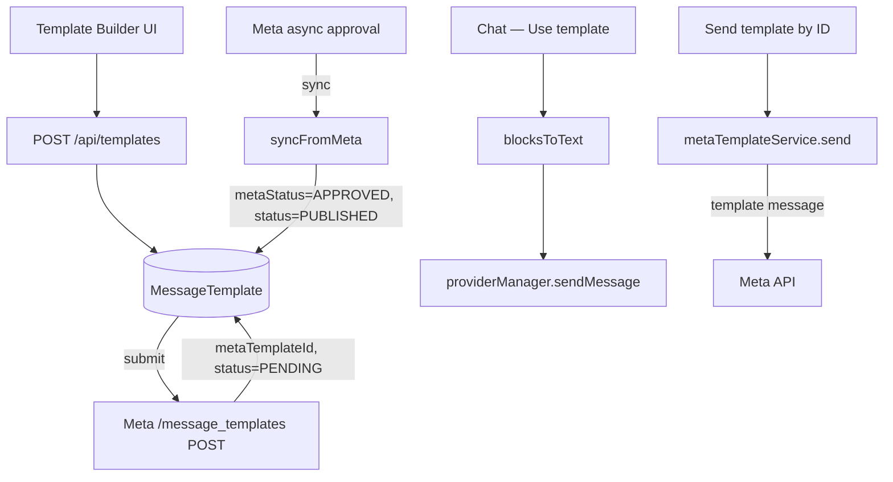

## 5.7 Limitations

- **Preview / send mismatch** — the rich preview is misleading. Users build a flashy promo card and recipients get plain text with emojis.
- **No schema validation before submission** — invalid component combinations are caught by Meta hundreds of milliseconds later with vague messages.
- **`syncFromMeta` upsert is fragile** — uses `id: (await findFirst{ metaTemplateId })?.id ?? 'new'` which is a string literal, relying on `'new'` not existing as an actual `cuid` to trigger create. Works, but ugly.
- **Variables array is positional and brittle** — reorder a variable in the builder and you silently change which value lands in which slot.
- **Outbound interactive support is broken end-to-end** — see §3.5.

## 5.8 Improvements

- Treat the rich builder and Meta templates as **two separate models** internally, with a converter between them.
- Add a validator that checks `payload` against the Meta component schema before allowing submit.
- Move `blocksToText` to the backend so all surfaces (chat, automations, broadcasts) render identically.
- Add a "what the recipient will see" preview alongside the builder preview.

---

# 6. Automation System

Two distinct engines coexist:

## 6.1 Simple Rule Engine

[apps/backend/src/automations/engine.ts](apps/backend/src/automations/engine.ts) — `checkAutomationRules(phone, body)`.

- Iterates all `AutomationRule` rows where `isActive`.
- Triggers: `KEYWORD` (case-insensitive substring), `FIRST_MESSAGE` (count of inbound = 1), `ANY_MESSAGE`, `OUTSIDE_HOURS` (hard-coded Africa/Cairo, 09:00–18:00 office hours).
- One-shot — sends `rule.response` via `providerManager.sendMessage` with retry.
- Bumps daily `Analytics.automationsFired` counter.
- **No team scoping in the query.** Every rule fires for every inbound regardless of team — see §12.

## 6.2 Multi-Step Flow Engine

[apps/backend/src/automations/flow-executor.ts](apps/backend/src/automations/flow-executor.ts)

- Backed by **Bull / Redis** queue `automation-flow-steps`.
- A `Flow` has ordered `Steps` of two types: `SEND_MESSAGE` or `WAIT` (with `delayMs`).
- Each step is one queued job. WAIT steps are encoded as `bull.add({...}, { delay })` for the next step.
- `AutomationFlowExecution` rows track `currentStep` and `status` (`RUNNING|COMPLETED|STOPPED`).
- `stopOnReply` on the flow stops all `RUNNING` executions for a phone when a human reply arrives — see `stopFlowExecutionsOnReply` called from the inbound workflow.
- Triggers: same enum as rules plus `NO_RESPONSE_TIME` (see §6.3) — but `KEYWORD|FIRST_MESSAGE|ANY_MESSAGE|OUTSIDE_HOURS` are the only ones the inbound path fires.

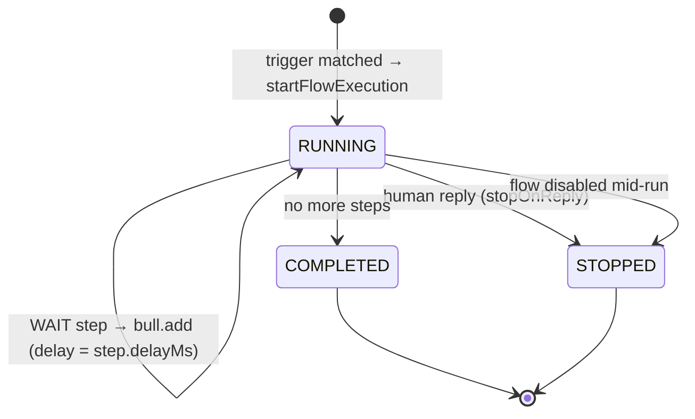

## 6.3 No-Reply Detector

[apps/backend/src/automations/no-reply-detector.ts](apps/backend/src/automations/no-reply-detector.ts)

- Runs every 5 min (`NO_REPLY_CHECK_INTERVAL_MS`).
- Finds `OPEN` conversations with `lastMessageAt` older than `NO_REPLY_THRESHOLD_MS` (30 min default).
- For each, if no outbound has happened after the threshold, fires `triggerFlows(phone, '', 'NO_RESPONSE_TIME', teamId)`.

## 6.4 Trigger Enum Surface

`TriggerType` declares many possibilities (`REGEX`, `CONTAINS_URL`, `SENTIMENT_NEGATIVE`, `TAG_ADDED`, `STATUS_CHANGE`, `TIME_BASED`, `DAY_OF_WEEK`, `WEBHOOK`, `API_CALL`) that have **no implementation** — they exist in the enum but no code matches against them. Treat the enum as aspirational.

## 6.5 Limitations

- Two engines, two trigger paths, slightly different semantics. There is no unified "trigger detected → enqueue" pipeline.
- Rules engine has **no team scoping** — rules from any team match against any phone. Bug.
- All `findMany` over rules / flows on every inbound message — fine for small numbers, will become O(N × inbound rate) at scale.
- Flow `WAIT` step granularity is `delayMs`, but Redis at-least-once delivery + Bull retry attempts (3, exponential 500 ms) mean the same step can fire twice if the worker crashes mid-step. No idempotency check inside the step handler.
- `OUTSIDE_HOURS` is hard-coded to Africa/Cairo. Multi-tenant timezone support is missing.

## 6.6 Scaling Path

- Single queue process today. Bull supports multiple workers — but `processIncomingMessage` is not idempotent end-to-end if a flow step double-fires.
- A future event-bus architecture would let the rule engine, flow engine, and analytics all listen for `message.received` without coupling.

---

# 7. Campaign / Broadcast System

## 7.1 Data Model

```
Broadcast {
  message, status, type,
  scheduledAt, recurringCron, timezone,
  totalSent, totalFailed,
  recipients: BroadcastRecipient[]
}
BroadcastRecipient { phone, status: pending|sent|failed }
```

## 7.2 Lifecycle

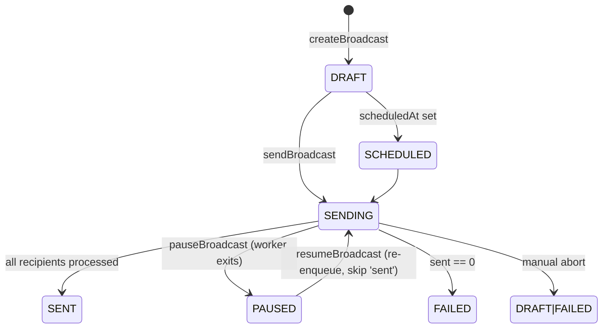

## 7.3 Worker

[apps/backend/src/broadcasts/broadcast.queue.ts](apps/backend/src/broadcasts/broadcast.queue.ts)

- One Bull queue `broadcast-sends`. One job per broadcast (not per recipient).
- Loops through `recipients`, sending sequentially.
- **Anti-ban pacing:** randomized delay between sends, `BROADCAST_DELAY_MIN_MS` (1.5 s) to `BROADCAST_DELAY_MAX_MS` (4 s).
- **Pause/resume:** re-reads broadcast status between sends; on `PAUSED` exits cleanly. Resume re-enqueues — already-sent recipients are skipped.
- **Personalization:** `{{name}}` / `{{phone}}` placeholders replaced from the contact row.
- **Realtime:** emits `broadcast:progress` after every send, `broadcast:complete` at the end.

## 7.4 Recipient Resolution

[apps/backend/src/broadcasts/broadcasts.service.ts:10-39](apps/backend/src/broadcasts/broadcasts.service.ts#L10-L39)

Two sources: direct phone list and tag-based query. Tag matching reads the **legacy CSV `Contact.tag` field**, splitting and comparing case-insensitively. The relational `ContactTag` table is **not used** for recipient resolution yet. See §12.

## 7.5 Limitations

- **One job per broadcast** means a single broadcast cannot be parallelized across multiple workers.
- **Cron-style recurring broadcasts** have a schema field (`recurringCron`) but no scheduler — must be triggered manually.
- **No per-recipient retry tracking** — a transient failure is recorded as `failed` and the recipient is not retried automatically.
- **Personalization uses contact phone only** — no joins to deals, tasks, or custom fields.
- **Tag-based selection ignores the relational tags model.**
- **No template send via broadcast** — only free-form text. For Meta-only deployments this means broadcasts won't work outside the 24-hour window for any recipient.

## 7.6 Anti-Spam Considerations

The randomized delay is the **only** anti-ban mechanism. Real production-grade campaigns need:

- per-number rate caps respecting Meta's tier system (250 → 1k → 10k → 100k recipients per day)
- failure-rate kill-switch (auto-pause if e.g. 20 % of last 50 sends failed)
- opt-out / STOP handling
- "do not contact" allowlist

None of these exist.

---

# 8. Contact & CRM System

## 8.1 Data Model

Contact is the hub:

```
Contact 1 ── * Conversation ── * Message
        1 ── * Deal
        1 ── * Task
        1 ── * ContactTag ── 1 Tag
```

Plus per-contact `customFields` JSON (used for `avatarUrl` today), `lifecycleStage` (LEAD by default), and `tag` (CSV, legacy).

## 8.2 Conversation Resolution

[apps/backend/src/conversations/conversation-resolver.ts](apps/backend/src/conversations/conversation-resolver.ts)

`getOrCreateConversationByPhone(phone, teamId?, db?)` does a lot:

1. Normalize phone, build digit variants (last 8/9 digits) to handle dial-code variation.
2. Resolve `teamId` — from arg, then `WHATSAPP_TEAM_ID` env, then "first user with a team".
3. Find existing contact via phone variants. Create with team if missing.
4. **Async** kick off avatar fetch via Baileys profile picture URL.
5. Find all conversations for `(contactId, teamId)`. Keep the most recent; **DELETE the rest** and all their messages.

That last step is dangerous — see §12.

## 8.3 Auto-Assignment

[apps/backend/src/conversations/auto-assign.service.ts](apps/backend/src/conversations/auto-assign.service.ts)

- Only runs if the team has `autoAssign = true` and `AUTO_ASSIGN_ENABLED !== 'false'`.
- Picks the AGENT or TEAM_LEAD with the fewest `OPEN` conversations assigned.
- Calls `ConversationsService.assignConversation` to write and emit.

## 8.4 Lifecycle Diagram

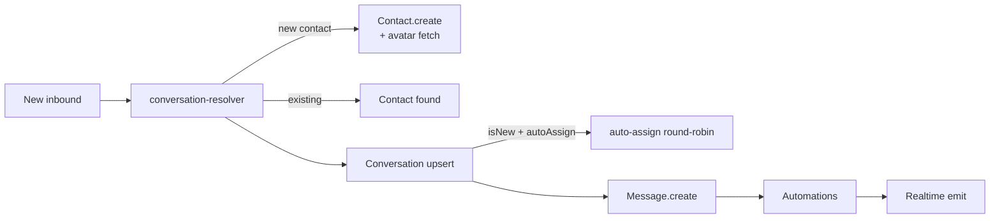

## 8.5 Tagging

Two parallel systems:

- **Legacy CSV** — `Contact.tag` is a comma-separated string. Still consulted by broadcast recipient resolution.
- **Relational** — `Tag` + `ContactTag` join table. Used by the contacts UI for filtering and tagging, but not yet by broadcasts.

Migration is incomplete.

## 8.6 Limitations

- **Destructive dedup:** the resolver deletes "duplicate" conversations and *all their messages*. There is no guard for OPEN conversations or message volume.
- **Cross-team phone collisions:** `Contact.phone` is globally `@unique`. Two teams cannot independently own the same phone number. Hard limit on multi-tenant.
- **Default team fallback** picks "first user with a team" — fine for single-tenant, broken for multi-tenant.
- **Indexes** are reasonable but lacking on `Contact.lifecycleStage` and `Conversation.priority`.
- **No event log** on contact / conversation mutations (status change, assignment change) — `AuditLog` exists but is barely populated.

---

# 9. Frontend Architecture

## 9.1 Stack

- **Next.js 14 App Router** with React Server Components disabled for all interactive pages (`'use client'` everywhere under `app/(dashboard)`).
- **NextAuth** for session, layered over a custom backend JWT login. Token is also written to `localStorage` for the socket client.
- **No global state manager** — pure component state + `useEffect` data fetching. React Query is *not* used despite being declared as a future direction.
- **socket.io-client** singleton in [`lib/socket.ts`](apps/frontend/lib/socket.ts) — one connection per browser tab.
- **lucide-react** icons, **Tailwind** classes for styling, **dark mode** via class on `<html>` set by an inline pre-hydration script.

## 9.2 Route Structure

```
app/
  login/                     unauthenticated
  (dashboard)/               authenticated route group
    layout.tsx               sidebar + header + NotificationProvider
    dashboard/               overview stats
    conversations/           inbox + chat
    contacts/                CRM list + drawer
    automations/             rule list + flow builder
    broadcasts/{new,[id]/edit}
    templates/               list + drag-and-drop builder
    deals/                   pipeline kanban
    tasks/                   task list
    tags/                    tag management
    saved-replies/           shortcut snippets
    settings/                user prefs
    admin/{users,teams}      admin-only
```

## 9.3 Data Flow

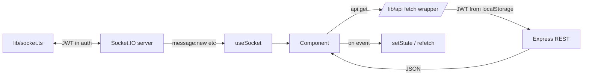

The pattern is: **fetch once on mount, refetch on relevant socket event, mutate via REST then wait for the echo event**.

## 9.4 Authentication Flow

- Login posts to `/api/auth/login`, receives `accessToken` + `refreshToken`.
- NextAuth wraps these into a session.
- `apiRequest` (in [lib/api.ts](apps/frontend/lib/api.ts)) reads the access token from session or localStorage. On 401/403 it transparently tries `/api/auth/refresh` once.
- Socket connect reads the same token in its `auth` callback so a fresh token is used on every reconnect.

## 9.5 Realtime Reconciliation

Most lists implement the same pattern:

1. `useEffect(() => fetchList(), [filters])` to load initial data.
2. `useSocket('message:new', cb)` and similar — on event, either patch local state or call `fetchList()`.
3. A user-triggered "refresh" button as a fallback.

This is simple but produces unnecessary refetches. With React Query (planned) this would collapse to an invalidate-on-event pattern.

## 9.6 Limitations

- **No optimistic send.** See §2.5.
- **No request deduplication / caching.** Two components fetching `/api/contacts` both make HTTP calls.
- **Every list refetches on every event.** Cheap today, will not scale to thousands of conversations.
- **Rerender churn.** ChatWindow's state is large (~30 `useState` hooks). Splitting into smaller components or a reducer is overdue.
- **localStorage tokens** survive logouts of other tabs — manual cleanup only.
- **No service worker.** Notifications work but only when a tab is open and focused.
- **Dual auth state** (NextAuth + localStorage) drifts when one half clears.

---

# 10. Database Architecture

## 10.1 Schema Philosophy

- **Postgres + Prisma**. No raw SQL in the codebase except via `prisma.$transaction`.
- **CUIDs** for all IDs.
- **Soft deletes are not used** — everything cascades or hard-deletes.
- **No partitioning, no sharding** — single DB, single team's data lives next to every other team's.
- **Foreign keys with `onDelete: Cascade`** where it makes sense (broadcast recipients, flow steps, reactions, contact tags). Conversation messages do *not* cascade — they outlive their conversation if it's deleted (which means orphans can appear).

## 10.2 Entity Diagram (selected)

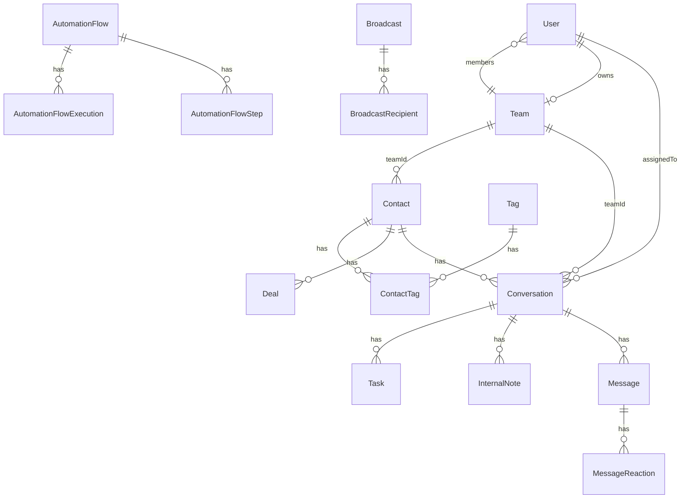

## 10.3 Key Indexes

| Index | Why it exists |
|---|---|
| `Message @@unique([externalId, sessionId])` | Inbound dedup |
| `Message @@index([conversationId, timestamp DESC])` | Paginated message reads in chat |
| `Conversation @@index([teamId, status, lastMessageAt DESC])` | Inbox view query |
| `Conversation @@index([snoozedUntil])` | Snooze wake-up scheduler scans every minute |
| `Contact @@index([teamId])`, `@@index([phone])` | Tenancy + lookup |
| `AutomationFlow @@index([teamId, isActive])` | Trigger fan-out |
| `AutomationFlowExecution @@index([phone, status])` | `stopFlowExecutionsOnReply` |

## 10.4 Provider-Aware Columns

| Field | Purpose |
|---|---|
| `Message.externalId` | Provider message ID (`wamid` or Baileys `key.id`) |
| `Message.sessionId` | Provider session — Meta `phone_number_id`, Baileys JID |
| `MessageTemplate.metaTemplateId` / `metaStatus` | Meta WABA template state |
| `Conversation` — no provider field | Conversations are *provider-agnostic* — same conversation can receive both Meta and Baileys messages today |

## 10.5 Hot Paths

| Query | Frequency | Cost |
|---|---|---|
| `Message.findFirst { externalId, sessionId }` (dedup) | every inbound | indexed unique — O(log n) |
| `Message.findMany { conversationId } orderBy timestamp DESC LIMIT 50` | every chat open | indexed |
| `Conversation.findMany { teamId, status }` | inbox load | indexed |
| `AutomationRule.findMany { isActive }` | every inbound | unindexed scan; small N today |
| `Conversation.findMany { snoozedUntil <= now, status: ON_HOLD }` | every 60 s | indexed |

## 10.6 Scaling Risks

- **`Message` table grows fast.** No partitioning; archival is manual. At ~100 msgs/sec this becomes a problem in months.
- **`AutomationRule` and `AutomationFlow` full-scans** per inbound — fine at < 1k rules total, awful at 10k.
- **No multi-tenant data isolation in storage** — all teams in the same tables. A noisy team can degrade query performance for everyone.
- **No read replicas wired up.** Single primary handles everything.
- **`uploads/` is local FS.** Horizontal scaling means moving media to S3 / R2 / a managed blob store.

## 10.7 Optimization Opportunities

- Add a `provider` column on `Message` so we can query per-transport without overloading `sessionId`.
- Partition `Message` by `timestamp` (monthly).
- Move `uploads/` to object storage; store URLs.
- Add composite index on `AutomationRule (teamId, isActive)` and filter by team on the inbound path.
- Move `Conversation.lastMessage*` writes to a materialized view or denormalized hot-cache to avoid the 2nd write on every inbound.

---

# 11. Security & Permissions

## 11.1 Authentication

- **Login:** email + password, bcrypt-hashed. JWT signed with `JWT_SECRET`. Access token + refresh token issued.
- **Refresh:** `/api/auth/refresh` exchanges a refresh token for a new access token. The refresh token ID is stored on the User row (`refreshTokenId`) to enable revocation.
- **Socket:** JWT verified in `io.use(middleware)` — same secret, same validation as REST.

## 11.2 Authorization

[apps/backend/src/auth/auth.middleware.ts](apps/backend/src/auth/auth.middleware.ts)

Two layers:

- **`authMiddleware`** — required for every authenticated route. Hydrates `req.user` with `{ id, email, name, role, teamId }`.
- **`checkPermission(action, resource)`** — a coarse role gate:
  - `VIEWER` — read-only, no broadcasts, no messages
  - `ANALYST` — read-only across the board
  - `AGENT` — can do anything except `delete`
  - `TEAM_LEAD`, `ADMIN`, `SUPER_ADMIN` — full

There is **no resource-level policy** — an AGENT in team A can fetch any conversation by ID, including team B's, because routes don't enforce `teamId` matching on every read.

## 11.3 Tenancy Isolation

The story:

- Realtime is team-scoped via `team:{teamId}` rooms.
- DB queries *mostly* filter by `teamId`.
- REST endpoints *mostly* filter by `req.user.teamId`.

The reality (see §12):

- `AutomationRule` reads do not filter by team.
- `Contact.phone` is globally unique — same phone in two teams is impossible.
- `getOrCreateConversationByPhone` falls back to "first user with a team" when no team context is available.
- Global socket emits (`wa:status`) reach all tenants.

## 11.4 Provider Credentials

- All Meta credentials in `.env` (`META_ACCESS_TOKEN`, `META_PHONE_NUMBER_ID`, `META_BUSINESS_ACCOUNT_ID`, `META_WEBHOOK_VERIFY_TOKEN`).
- Baileys credentials in the `auth_info_baileys/` directory on the backend filesystem.
- **Neither is encrypted at rest.** Anyone with shell access has the keys.
- No per-team provider configuration — one Meta account serves the whole platform.

## 11.5 Webhook Verification

- Meta webhook GET handshake checks `hub.verify_token` against `META_WEBHOOK_VERIFY_TOKEN`.
- Meta webhook POST **does not verify the `X-Hub-Signature-256` header**. Anyone who knows the URL can post fake events.

## 11.6 Other

- **CORS** is allowlist-based, restricted to `FRONTEND_URL`.
- **Express body limit** 2 MB.
- **Uploads:** Multer with no MIME-type whitelist — any file is accepted.
- **No rate limiting** on any endpoint. A malicious authenticated user can flood `/api/conversations` or trigger broadcasts at will.
- **`/uploads/*` is publicly served** with no auth — uploaded media is reachable by anyone with the URL.

## 11.7 Future Hardening

- Verify Meta webhook signatures (`X-Hub-Signature-256`).
- Add per-team WhatsApp credential rows; encrypt with KMS or libsodium.
- Resource-level policy: every `Conversation.findFirst` should include `teamId: req.user.teamId`.
- Signed URLs for `/uploads/*`.
- Rate limiting middleware (express-rate-limit or cloudflare).
- Audit log expansion — currently `AuditLog` model exists but only a fraction of routes write to it.

---

# 12. Current Limitations & Technical Debt

This section is the **honest punch list**. Severity is rough.

## 12.1 Provider / Messaging

| Issue | Severity | Notes |
|---|---|---|
| Meta inbound media never downloaded | **High** | `meta-media://{id}` is stored but no fetcher exists. UI renders broken images. |
| Meta async `failed` webhook status dropped | **High** | `mapStatus` returns undefined for `failed`. A 24-hour-window failure is invisible. |
| Outbound rich/interactive messages flattened to text | **High** | Builder produces rich payload; send path runs `blocksToText`. Recipients never see buttons. |
| Two outbound persistence paths | Medium | Meta uses `persistOutboundMessage`; Baileys uses inline DB writes in `sender.ts`. Drift risk. |
| Baileys still receives inbound when Meta is primary | Medium | Duplicate ingestion possible if both providers are connected to the same phone. |
| No webhook signature verification | Medium | `/meta-webhook` accepts any POST with the right body shape. |
| `getStatus` only reports primary | Low | Fallback health is invisible to ops. |

## 12.2 Realtime

| Issue | Severity | Notes |
|---|---|---|
| Global emit on null `teamId` | **High** | Cross-tenant leak if a code path forgets `teamId`. |
| `unreadCount` race | Medium | Socket payload uses pre-update value while DB increments atomically. |
| No event ordering / sequence numbers | Medium | Late events can overwrite fresher state. |
| Reconnect storms broadcast `wa:status` to everyone | Low | Cosmetic noise. |

## 12.3 Automations

| Issue | Severity | Notes |
|---|---|---|
| Rules engine not team-scoped | **High** | Rules from team A fire on inbound destined for team B. |
| Trigger enum has many unimplemented values | Medium | Confusing for users — UI shows options that don't work. |
| Flow step double-fire on worker crash | Medium | Bull at-least-once + no per-step idempotency key. |
| OUTSIDE_HOURS hard-coded to Africa/Cairo | Medium | Multi-region timezone support missing. |
| `findMany` over all rules per inbound | Low at current scale | Becomes problem at 10k+ rules. |

## 12.4 Broadcasts

| Issue | Severity | Notes |
|---|---|---|
| Tag selection uses legacy CSV field | Medium | Relational tags ignored. |
| No retry per recipient | Medium | Transient failures stay failed. |
| No template send via broadcast | Medium | Blocks Meta-only deployments outside 24-hour window. |
| Recurring (`recurringCron`) is schema-only | Low | No scheduler wired. |
| No rate-limit awareness (Meta tiers) | Medium | Could trip phone tier downgrades at volume. |
| No opt-out / STOP handling | **High** | Compliance risk. |

## 12.5 Data / Multi-tenancy

| Issue | Severity | Notes |
|---|---|---|
| `Contact.phone` globally unique | **High** | Hard block on multi-tenant. Two teams can't have the same customer. |
| Conversation resolver hard-deletes "duplicates" | **High** | Destructive. No guards for OPEN state or message count. |
| `WHATSAPP_TEAM_ID` fallback chooses "first user with team" | **High** | Bug in multi-tenant; works only single-tenant. |
| `/uploads/*` is unauthenticated | Medium | Anyone with the URL can fetch. |
| No DB partitioning on Message | Low today | Time bomb at scale. |

## 12.6 Frontend

| Issue | Severity | Notes |
|---|---|---|
| No optimistic UI | Medium | Send feels slow. |
| React Query absent | Medium | Manual fetch + refetch everywhere. |
| Token in localStorage | Medium | XSS exfiltration risk. |
| Dual auth state (NextAuth + localStorage) drifts | Low | Edge-case logouts. |
| ChatWindow has ~30 useState hooks | Low | Rerender cost. |

## 12.7 Security

| Issue | Severity | Notes |
|---|---|---|
| No rate limiting anywhere | **High** | DoS-trivial. |
| Resource-level authz missing | **High** | Read-by-ID across teams works. |
| Webhook signature not verified | Medium | Spoofable. |
| Uploads accept any MIME | Medium | Antivirus + size limits needed. |
| Provider creds plaintext on disk | Medium | Encrypt at rest. |

---

# 13. Future Roadmap

These are directions the codebase already leans toward. Not commitments.

## 13.1 Full Meta API Migration

- Implement Meta inbound media fetcher (`graph.facebook.com/{mediaId}` → upload to storage → rewrite `mediaUrl`).
- Wire Meta async `failed` status into `handleMessageStatusUpdates` so the UI sees real delivery state.
- Signature-verify Meta webhooks.
- Disable Baileys auto-connect in production (`WHATSAPP_AUTO_CONNECT=false`) once Meta is verified end-to-end.
- Per-team provider credentials (move config out of `.env` into `Team.providerConfig` JSON, encrypted).

## 13.2 Interactive Messages End-to-End

- Extend `SendMessageInput` with an `interactive` field (buttons / list).
- Add a Meta-shape converter for buttons (`reply` action type) and lists.
- Inbound: preserve the structured interactive payload alongside `body` so chat can render real button replies.
- Frontend template builder: drop `blocksToText`, send the structured payload.

## 13.3 Queue Architecture Evolution

- Move automation rule matching off the inbound critical path — emit `message.received` to an internal event bus (BullMQ stream or NATS), let rule/flow/analytics workers consume independently.
- Per-recipient broadcast jobs instead of per-broadcast jobs → enables horizontal scaling.
- Idempotency keys on flow step jobs to prevent double-fire.

## 13.4 Event Bus

A dedicated event bus with a fixed catalog:

```
message.received
message.sent
message.delivered
message.read
message.failed
conversation.assigned
conversation.snoozed
template.approved
template.rejected
provider.connected
provider.disconnected
```

All providers emit, all features subscribe. Decouples the inbound workflow from automations / analytics / notifications.

## 13.5 SaaS Billing & Multi-Tenancy

- Per-team Meta credentials.
- Drop the global `Contact.phone` unique — move to `@@unique([teamId, phone])`.
- Resource-level authz on every find/update — likely a Prisma middleware that injects `teamId`.
- Stripe + usage metering (message count, broadcast volume, automation executions).
- Storage isolation: move uploads to object storage with per-team prefixes.

## 13.6 Multi-Provider Expansion

The interface already permits this; the work is integration:

- **Twilio WhatsApp** — webhooks similar to Meta; different template approval flow.
- **360Dialog** — Meta-compatible API but its own credential model.
- **Evolution API** — community Baileys gateway, useful for development.

The right shape is a `providerCapabilities` field on each provider — what it supports (templates, lists, reactions, ephemeral messages) — and the manager picks based on the message type.

## 13.7 Analytics

Today's `Analytics` table is a single daily counter row. A real analytics layer would:

- per-message events to a column-oriented store (ClickHouse, BigQuery, DuckDB-on-Postgres).
- agent productivity dashboards (response time, resolution rate, FCR).
- broadcast funnel (sent → delivered → read → replied → converted).
- automation effectiveness (rules fired vs human takeover rate).

## 13.8 AI Integrations

The system has the right shape for AI features without large refactors:

- **Suggested replies** — call an LLM with the conversation history on every inbound, surface 3 suggestions in the agent UI. Latency-tolerant.
- **Auto-classify** — set `lifecycleStage` and tags from message content.
- **Auto-summarize on assignment** — give the new agent a 3-line summary of the last 50 messages.
- **Sentiment-based routing** — fill in the `SENTIMENT_NEGATIVE` trigger.
- **Template auto-translate** — language-aware sends.

## 13.9 Operational

- Structured logging to a real log aggregator (Loki, Datadog, ELK).
- Health checks on `/health` covering DB, Redis, Meta API reachability, Baileys session age.
- Migrations from local `auth_info_baileys/` to a DB-backed `WhatsAppSession` table (model exists, unused).
- Dockerized backend + frontend with a docker-compose for new-hire onboarding.

---

## Appendix A — Environment Variables

| Variable | Required | Default | Purpose |
|---|---|---|---|
| `DATABASE_URL` | yes | — | Postgres connection string |
| `REDIS_URL` | yes | `redis://127.0.0.1:6379` | Bull queue backend |
| `JWT_SECRET` | yes | — | Signing key for auth + socket |
| `PORT` | no | 4000 | Backend listen port |
| `FRONTEND_URL` | yes | `http://localhost:3000` | CORS + socket origin |
| `WHATSAPP_PROVIDER` | no | `baileys` | `meta` or `baileys` |
| `WHATSAPP_ALLOW_FALLBACK` | no | `false` | Allow Meta → Baileys fallback on send error |
| `WHATSAPP_AUTO_CONNECT` | no | true | Set `false` to skip auto-connect on boot |
| `WHATSAPP_SESSION_ID` | no | `default` | Fallback session ID label |
| `WHATSAPP_TEAM_ID` | no | — | Default team for unrouted inbound |
| `META_ACCESS_TOKEN` | when provider=meta | — | Graph API bearer |
| `META_PHONE_NUMBER_ID` | when provider=meta | — | WhatsApp phone number ID |
| `META_BUSINESS_ACCOUNT_ID` | when provider=meta | — | WABA ID for template ops |
| `META_FROM_PHONE` | no | — | Override display phone (e.g. `15556501334`) |
| `META_WEBHOOK_VERIFY_TOKEN` | yes if Meta webhook used | — | Webhook handshake secret |
| `META_TEMPLATE_NAMESPACE` | no | — | Reserved for HSM namespace |
| `WHATSAPP_WEBHOOK_SECRET` | no | — | Legacy inbound webhook secret |
| `AUTO_ASSIGN_ENABLED` | no | `true` | Set `false` to disable auto-assign |
| `AUTOMATION_RESPONSE_DELAY_MS` | no | 0 | Human-like delay on rule responses |
| `BROADCAST_DELAY_MIN_MS` | no | 1500 | Anti-ban min |
| `BROADCAST_DELAY_MAX_MS` | no | 4000 | Anti-ban max |
| `NO_REPLY_THRESHOLD_MS` | no | 1800000 | 30 min default |
| `NO_REPLY_CHECK_INTERVAL_MS` | no | 300000 | 5 min default |

## Appendix B — Key File Index

| Concern | File |
|---|---|
| Provider interface | [apps/backend/src/providers/types.ts](apps/backend/src/providers/types.ts) |
| Provider manager | [apps/backend/src/providers/manager.ts](apps/backend/src/providers/manager.ts) |
| Meta provider | [apps/backend/src/providers/meta.provider.ts](apps/backend/src/providers/meta.provider.ts) |
| Meta webhook handler | [apps/backend/src/providers/meta-webhook.handler.ts](apps/backend/src/providers/meta-webhook.handler.ts) |
| Baileys provider | [apps/backend/src/providers/baileys.provider.ts](apps/backend/src/providers/baileys.provider.ts) |
| Baileys socket lifecycle | [apps/backend/src/whatsapp/client.ts](apps/backend/src/whatsapp/client.ts) |
| Baileys sender (legacy) | [apps/backend/src/whatsapp/sender.ts](apps/backend/src/whatsapp/sender.ts) |
| Inbound workflow | [apps/backend/src/workflow/inbound-workflow.ts](apps/backend/src/workflow/inbound-workflow.ts) |
| Status handler | [apps/backend/src/whatsapp/handler.ts](apps/backend/src/whatsapp/handler.ts) |
| Outbound persistence | [apps/backend/src/messaging/persist-outbound.ts](apps/backend/src/messaging/persist-outbound.ts) |
| Conversation resolver | [apps/backend/src/conversations/conversation-resolver.ts](apps/backend/src/conversations/conversation-resolver.ts) |
| Auto-assign | [apps/backend/src/conversations/auto-assign.service.ts](apps/backend/src/conversations/auto-assign.service.ts) |
| Snooze scheduler | [apps/backend/src/conversations/snooze-wakeup.ts](apps/backend/src/conversations/snooze-wakeup.ts) |
| Rule engine | [apps/backend/src/automations/engine.ts](apps/backend/src/automations/engine.ts) |
| Flow executor | [apps/backend/src/automations/flow-executor.ts](apps/backend/src/automations/flow-executor.ts) |
| No-reply detector | [apps/backend/src/automations/no-reply-detector.ts](apps/backend/src/automations/no-reply-detector.ts) |
| Broadcast worker | [apps/backend/src/broadcasts/broadcast.queue.ts](apps/backend/src/broadcasts/broadcast.queue.ts) |
| Template render | [apps/backend/src/services/template.service.ts](apps/backend/src/services/template.service.ts) |
| Meta template service | [apps/backend/src/services/meta-template.service.ts](apps/backend/src/services/meta-template.service.ts) |
| Socket.IO server | [apps/backend/src/realtime/socket.ts](apps/backend/src/realtime/socket.ts) |
| Auth middleware | [apps/backend/src/auth/auth.middleware.ts](apps/backend/src/auth/auth.middleware.ts) |
| Prisma schema | [apps/backend/prisma/schema.prisma](apps/backend/prisma/schema.prisma) |
| Frontend socket singleton | [apps/frontend/lib/socket.ts](apps/frontend/lib/socket.ts) |
| Frontend API client | [apps/frontend/lib/api.ts](apps/frontend/lib/api.ts) |
| Chat window | [apps/frontend/components/conversations/ChatWindow.tsx](apps/frontend/components/conversations/ChatWindow.tsx) |
| Conversation list | [apps/frontend/components/conversations/ConversationList.tsx](apps/frontend/components/conversations/ConversationList.tsx) |
| Template builder | [apps/frontend/app/(dashboard)/templates/builder/page.tsx](apps/frontend/app/(dashboard)/templates/builder/page.tsx) |
