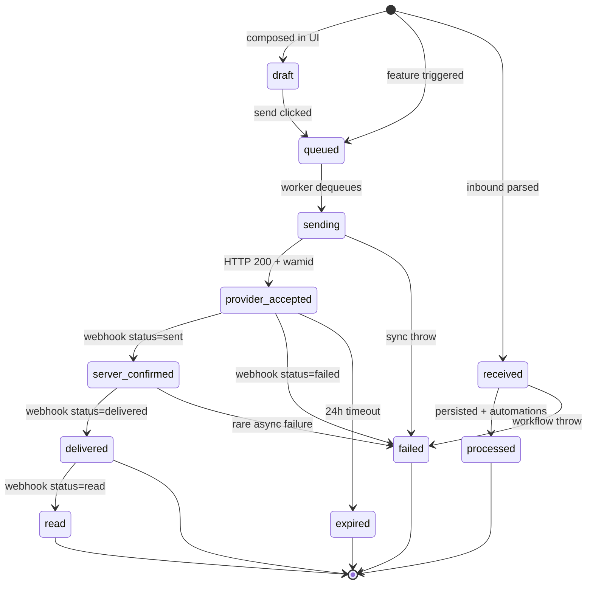
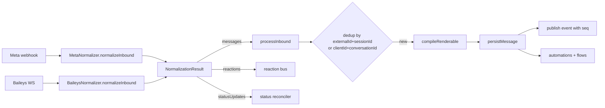
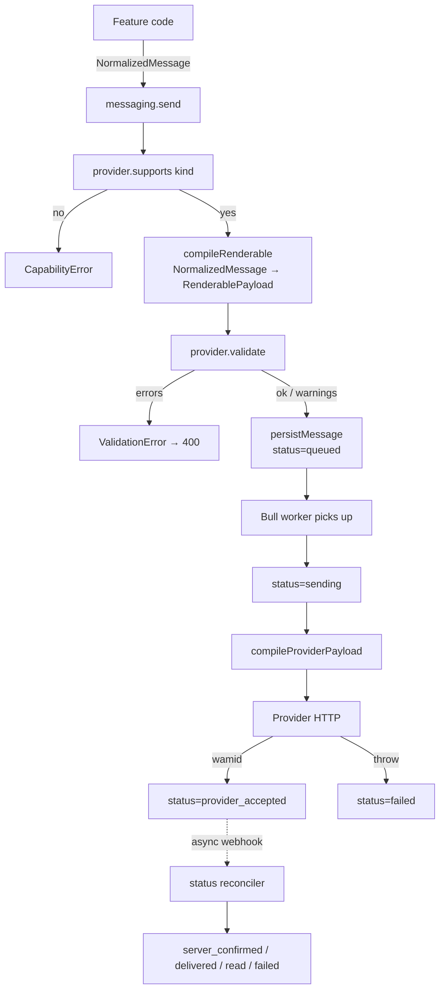
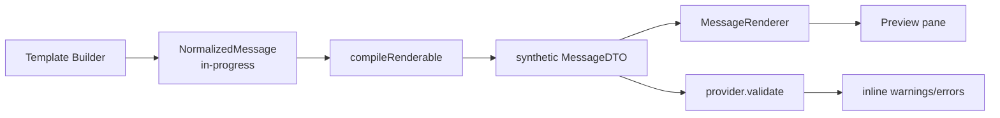
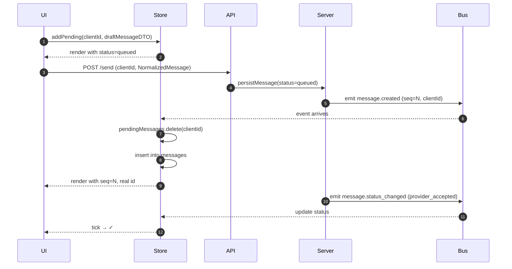
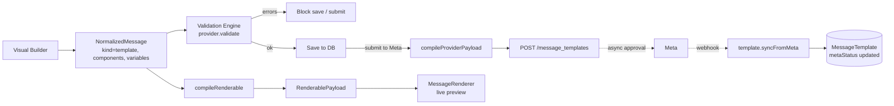

# Messaging Platform Architecture — Design Proposal (Phase 1)

> **Status:** Review draft v2. No code changes until approved.
> **Scope:** The canonical schema, validation pipeline, renderable layer, realtime store, and provider model that turn this CRM into a WhatsApp-native messaging platform.
> **Reviewers:** read top-to-bottom; trade-offs are explicit in §16.

This document supersedes v1. It integrates the seven post-v1 refinements:

1. Two-tier provider checks: `supports()` *and* `validate()`
2. **RenderablePayload** as an intermediate layer between intent and provider
3. Compatibility modes (`cloud_api | web_compatible | mobile_safe | fallback_text`)
4. Interactive Safe Mode with deterministic downgrade rules
5. Canonical WhatsApp bubble system (renderer visual spec)
6. Realtime consistency layer — canonical store + event reconciliation
7. Full ACK pipeline (`queued → sending → provider_accepted → server_confirmed → delivered → read`)

---

## Table of Contents

1. [Design Principles](#1-design-principles)
2. [End-to-End Pipeline](#2-end-to-end-pipeline)
3. [NormalizedMessage — Type Design](#3-normalizedmessage--type-design)
4. [Kind vs MediaType](#4-kind-vs-mediatype)
5. [RenderablePayload Layer](#5-renderablepayload-layer)
6. [Compatibility Modes](#6-compatibility-modes)
7. [Status — Full ACK Pipeline](#7-status--full-ack-pipeline)
8. [Metadata](#8-metadata)
9. [Validation Pipeline](#9-validation-pipeline)
10. [Downgrade Rules / Interactive Safe Mode](#10-downgrade-rules--interactive-safe-mode)
11. [Prisma Migration Strategy](#11-prisma-migration-strategy)
12. [Provider Normalization Strategy](#12-provider-normalization-strategy)
13. [Renderer Contract & Canonical Bubble System](#13-renderer-contract--canonical-bubble-system)
14. [Realtime Consistency Layer](#14-realtime-consistency-layer)
15. [Template System Architecture](#15-template-system-architecture)
16. [Trade-offs & Open Questions](#16-trade-offs--open-questions)
17. [Implementation Phases](#17-implementation-phases)
18. [Sign-off Checklist](#18-sign-off-checklist)

---

## 1. Design Principles

The platform is built around twelve non-negotiable rules:

| # | Principle | Why |
|---|---|---|
| 1 | **One shape, many providers** | Provider-specific code never leaks past the normalizer boundary. |
| 2 | **Kind ≠ media type** | A template can have an image header. An interactive list has no media. |
| 3 | **Discriminated unions everywhere** | TypeScript narrows by kind. Closed switches force exhaustive handling. |
| 4 | **`raw` is sacred** | Every normalized message carries the unmodified provider payload, server-side only. |
| 5 | **Renderer ≠ NormalizedMessage** | The renderer consumes a `RenderablePayload`. Same payload is used for preview *and* chat — guarantees preview parity. |
| 6 | **`supports()` ≠ `validate()`** | One asks "do you handle this kind?", the other asks "is *this specific payload* legal?". Both gate sending. |
| 7 | **Unknown kinds flow through** | Unsupported messages arrive as `kind: 'unknown'` with raw preserved. UI shows a graceful fallback. |
| 8 | **Downgrade is a first-class operation** | Compatibility mode + downgrade rules produce a guaranteed-deliverable payload. Failed deliveries are a bug, not a fact of life. |
| 9 | **Idempotency is built-in** | Every message has `clientId` (caller) and `externalId` (provider). Either suffices for dedup. |
| 10 | **Events carry sequence numbers** | Realtime store reconciles by `seq`; gap detection triggers resync. No more refetch-on-every-event. |
| 11 | **Status is a state machine, not a flag** | One reconciler validates transitions. Today's silently-dropped `failed` webhook becomes impossible. |
| 12 | **Capabilities live on the provider, not the message** | A `NormalizedMessage` describes intent. Whether *this provider* can deliver it is answered separately. |

---

## 2. End-to-End Pipeline

The full pipeline, in one picture. Every later section is a zoom-in on one box.

```mermaid
flowchart TD
    subgraph Compose["Compose"]
        UI[Agent UI / Automation / Broadcast / Template Builder]
        UI --> NM[NormalizedMessage<br/>kind, content, metadata]
    end

    subgraph Plan["Plan & Validate"]
        NM --> CM[Compatibility Compiler<br/>mode + downgrade rules]
        CM --> RP[RenderablePayload<br/>visual blocks + compatibility report]
        RP --> VA[Validation Engine<br/>provider.supports + provider.validate]
        VA -->|errors| Block[Block / surface to UI]
        VA -->|ok / warnings| Persist1[(persistMessage<br/>status=queued)]
    end

    subgraph Render["Render"]
        RP -.same payload.-> Renderer[MessageRenderer]
        Renderer --> Preview[Builder Preview]
        Renderer --> Chat[Chat Bubble]
    end

    subgraph Send["Send"]
        Persist1 --> PC[Provider Compiler<br/>RenderablePayload → ProviderPayload]
        PC --> HTTP[Provider HTTP / WebSocket]
        HTTP -->|wamid / id| ACK1[status=provider_accepted]
        HTTP -->|throw| Failed1[status=failed sync]
    end

    subgraph Reconcile["Reconcile"]
        Webhook[Provider Webhook<br/>or socket update] --> SR[Status Reconciler]
        SR --> SU[status: server_confirmed → delivered → read → failed → expired]
        SU --> Bus[Event Bus<br/>seq-numbered events]
        Bus --> Store[Realtime Canonical Store]
        Store --> UI2[UI subscriptions]
    end

    style Compose fill:#1e3a5f,stroke:#3b82f6
    style Plan fill:#3b1f5f,stroke:#a855f7
    style Render fill:#5f1f3f,stroke:#ec4899
    style Send fill:#1f5f3f,stroke:#10b981
    style Reconcile fill:#5f3f1f,stroke:#f59e0b
```



The key architectural moves vs today:

- **Compose produces intent, not API calls.** Features call `messaging.send(NormalizedMessage)` and never touch provider shapes.
- **The renderer's input is the same as what gets sent.** No separate preview code path.
- **Validation runs *before* persist.** Today we discover failures at the network layer; tomorrow we know before we hit the DB.
- **All status updates flow through one reconciler.** Today they're scattered across Baileys handlers and Meta webhooks.
- **The frontend subscribes to a canonical store, not raw socket events.** Reducers apply events; components read derived state.

---

## 3. NormalizedMessage — Type Design

The full TypeScript shape. This lives at `apps/backend/src/messaging/schema.ts` and is shared with the frontend via a workspace package `packages/messaging-schema`.

```ts
// ── Top-level shape ──────────────────────────────────────────────────────────

export interface NormalizedMessage {
  /** Schema version. Bumped on any breaking change. */
  schemaVersion: 1;

  /** Internal DB ID once persisted. Null in transit before save. */
  id: string | null;

  /** Caller-issued UUID for idempotency. (clientId, conversationId) is unique. */
  clientId: string;

  /** Provider-issued ID once accepted. wamid for Meta, key.id for Baileys. */
  externalId: string | null;

  /** Which provider produced or will deliver this message. */
  provider: ProviderName;

  /** Provider session — Meta phone_number_id, Baileys JID. */
  sessionId: string;

  /** Foreign keys. */
  conversationId: string;
  contactPhone: string;
  teamId: string | null;

  /** Direction is a hard property — never derived from fromMe. */
  direction: 'inbound' | 'outbound';

  /** Discriminated content (see §4). */
  content: MessageContent;

  /** Lifecycle status (see §7). */
  status: MessageStatus;

  /** Cross-cutting metadata (see §8). */
  metadata: MessageMetadata;

  /** Optional reply pointer — denormalized. */
  reply: ReplyReference | null;

  /** Wall-clock time — provider timestamp if inbound, server time if outbound. */
  timestamp: string; // ISO-8601

  /** Provider raw payload, server-side only. Stripped before sending to client. */
  raw: unknown;
}

export type ProviderName = 'meta' | 'baileys' | 'twilio' | '360dialog';

export interface ReplyReference {
  messageId: string | null;
  externalId: string | null;
  preview: string;
  kind: MessageKind;
}
```

The two big internal types — `MessageContent` and `MessageMetadata` — follow in §4 and §8.

---

## 4. Kind vs MediaType

`kind` is the *semantic shape* of the message. Media type (MIME) lives inside the content payload when relevant.

### 4.1 The Kind Enum

```ts
export type MessageKind =
  | 'text'                      // plain text
  | 'media'                     // single attachment + optional caption
  | 'template'                  // approved WhatsApp Business template
  | 'interactive_buttons'       // body + 1–3 quick-reply buttons
  | 'interactive_list'          // body + sectioned list of selectable rows
  | 'interactive_cta'           // body + single URL CTA button
  | 'interactive_product'       // single product reference (catalog)
  | 'interactive_product_list'  // multi-product catalog
  | 'location'                  // lat/lng + name/address
  | 'contact_card'              // vCard payload
  | 'order'                     // order receipt / acknowledgement
  | 'system'                    // provider-level event (not a chat bubble)
  | 'unknown';                  // preserved-as-raw for forward compat
```

Rules:

- Closed list **in code**, open string **in storage**. A future provider's new kind can round-trip without a schema migration.
- A renderer that doesn't recognise a kind falls back to the `unknown` bubble.
- Reactions are **not a kind** — they route to a side channel (see §4.5).

### 4.2 Discriminated Union — MessageContent

```ts
export type MessageContent =
  | TextContent
  | MediaContent
  | TemplateContent
  | InteractiveButtonsContent
  | InteractiveListContent
  | InteractiveCtaContent
  | InteractiveProductContent
  | InteractiveProductListContent
  | LocationContent
  | ContactCardContent
  | OrderContent
  | SystemContent
  | UnknownContent;
```

The full per-kind shapes:

```ts
export interface TextContent {
  kind: 'text';
  body: string;
  mentions?: string[];
  previewUrl?: boolean;
}

export interface MediaContent {
  kind: 'media';
  media: Media;
  caption?: string;
}

export interface Media {
  mediaType: 'image' | 'video' | 'audio' | 'document' | 'sticker' | 'voice';
  mime: string;
  url: string | null;                 // resolved local/CDN URL once available
  providerMediaId: string | null;     // Meta media ID / Baileys directPath
  fileName: string | null;
  sizeBytes: number | null;
  durationSec: number | null;         // audio/video only
  width: number | null;
  height: number | null;
  thumbnailUrl: string | null;
}

export interface TemplateContent {
  kind: 'template';
  templateName: string;
  templateLanguage: string;
  templateId: string | null;          // local MessageTemplate.id
  metaTemplateId: string | null;      // Meta WABA template ID
  components: TemplateComponent[];
  variables: Record<string, string>;  // resolved variable values
}

export type TemplateComponent =
  | { type: 'header'; format: 'text'; text: string }
  | { type: 'header'; format: 'image' | 'video' | 'document'; media: Media }
  | { type: 'body'; text: string }
  | { type: 'footer'; text: string }
  | { type: 'buttons'; buttons: TemplateButton[] };

export type TemplateButton =
  | { kind: 'quick_reply'; text: string; payload?: string }
  | { kind: 'url'; text: string; url: string; urlVariables?: string[] }
  | { kind: 'phone'; text: string; phoneNumber: string };

export interface InteractiveButtonsContent {
  kind: 'interactive_buttons';
  header?: InteractiveHeader;
  body: string;
  footer?: string;
  buttons: QuickReplyButton[];  // 1–3
}

export interface QuickReplyButton { id: string; title: string; }

export interface InteractiveListContent {
  kind: 'interactive_list';
  header?: InteractiveHeader;
  body: string;
  footer?: string;
  buttonText: string;
  sections: ListSection[];      // ≤10
}

export interface ListSection { title: string; rows: ListRow[]; }   // ≤10 rows
export interface ListRow      { id: string; title: string; description?: string; }

export interface InteractiveCtaContent {
  kind: 'interactive_cta';
  header?: InteractiveHeader;
  body: string;
  footer?: string;
  cta: { displayText: string; url: string };
}

export type InteractiveHeader =
  | { type: 'text'; text: string }
  | { type: 'media'; media: Media };

export interface LocationContent {
  kind: 'location';
  latitude: number; longitude: number;
  name?: string; address?: string;
}

export interface ContactCardContent {
  kind: 'contact_card';
  contacts: VCardLike[];
}

export interface SystemContent {
  kind: 'system';
  event: 'session_started' | 'session_ended' | 'media_processing' | 'message_recalled';
  detail?: string;
}

export interface UnknownContent {
  kind: 'unknown';
  providerKind: string;          // the kind the provider reported
  text?: string;                 // best-effort text representation if any
}
```

### 4.3 Why a Discriminated Union (vs flat object)

A flat object with nullable fields means every consumer writes:

```ts
if (m.type === 'IMAGE' && m.mediaUrl) { ... }     // brittle, no narrowing
```

The discriminated union gives:

```ts
switch (m.content.kind) {
  case 'media':    return renderMedia(m.content.media);
  case 'template': return renderTemplate(m.content);
}
```

Adding a new kind is a compile error in every consumer until it's handled.

### 4.4 Reply Handling

Reply is a *property* of any message, not a kind. The `reply` field denormalizes the quoted message so:

- the renderer doesn't need a JOIN
- a reply to a deleted message still renders correctly
- the wire payload is self-contained

### 4.5 Reactions — Side Channel, Not Kind

Reactions modify *other* messages; they're not bubbles. They never become a `NormalizedMessage`. The normalizer intercepts them:

```ts
export interface ReactionEvent {
  conversationId: string;
  targetExternalId: string;
  targetMessageId: string | null;
  emoji: string;                  // empty string = removal
  reactor: { phone: string } | { userId: string };
  timestamp: string;
}
```

---

## 5. RenderablePayload Layer

**This is the new architectural piece.** It sits between `NormalizedMessage` and `ProviderPayload`, and is also what the renderer consumes.

### 5.1 Why It Exists

```
       NormalizedMessage          ← INTENT
              ↓
    [Compatibility Compiler]      ← decide what's actually deliverable
              ↓
      RenderablePayload           ← VISUAL STRUCTURE
              ↓ ↓
              ↓ └→ Renderer        ← preview + chat
              ↓
      [Provider Compiler]         ← turn into provider API shape
              ↓
       ProviderPayload            ← actual Meta / Baileys call
```

Without this layer, three problems exist:

1. **Preview ≠ sent.** The renderer interprets `NormalizedMessage` one way, the provider interprets it another, and the recipient sees a third thing.
2. **Downgrade is invisible.** When `interactive_buttons` can't be sent and must become text, today there's no representation of the downgraded form — both the preview and the chat render the original intent.
3. **No single artifact for validation.** Validators today must read content + media + media size + template constraints from many fields.

`RenderablePayload` solves all three: **it is the single visual artifact**, the validator's input, the renderer's input, and the compiler's input. **Preview parity becomes structural, not aspirational.**

### 5.2 Type

```ts
export interface RenderablePayload {
  /** What the visual structure represents. May differ from NormalizedMessage.content.kind if downgraded. */
  kind: MessageKind;

  /** Visual blocks the renderer draws in order. Provider-agnostic. */
  blocks: RenderableBlock[];

  /** How this payload was produced. */
  compatibility: CompatibilityReport;
}

export type RenderableBlock =
  | { type: 'reply_quote';   preview: string; kind: MessageKind }
  | { type: 'header_text';   text: string }
  | { type: 'header_media';  media: Media }
  | { type: 'body_text';     text: string }
  | { type: 'media';         media: Media; caption?: string }
  | { type: 'footer';        text: string }
  | { type: 'reply_button';  id: string; title: string; disabled?: boolean }
  | { type: 'url_button';    title: string; url: string }
  | { type: 'phone_button';  title: string; phoneNumber: string }
  | { type: 'list_button';   buttonText: string; sections: ListSection[] }
  | { type: 'cta_card';      displayText: string; url: string }
  | { type: 'numbered_options'; intro?: string; options: NumberedOption[] }
  | { type: 'location';      latitude: number; longitude: number; name?: string; address?: string }
  | { type: 'contact_card';  contacts: VCardLike[] }
  | { type: 'product_card';  productId: string; title?: string; image?: Media }
  | { type: 'template_marker'; templateName: string; language: string; variables: Record<string,string> }
  | { type: 'unsupported';   reason: string; providerKind?: string };

export interface NumberedOption { number: number; label: string; payload?: string; }

export interface CompatibilityReport {
  mode: CompatibilityMode;
  originalKind: MessageKind;
  effectiveKind: MessageKind;
  downgraded: boolean;
  downgradeReason: string | null;
  warnings: ValidationIssue[];
}
```

### 5.3 The Compilers

Two thin functions, both pure:

```ts
// Compatibility compiler
export function compileRenderable(
  message: NormalizedMessage,
  provider: ProviderName,
  mode: CompatibilityMode,
): RenderablePayload;

// Provider compiler
export function compileProviderPayload(
  payload: RenderablePayload,
  provider: ProviderName,
): ProviderPayload;
```

`compileRenderable` is the one that may downgrade — see §10. `compileProviderPayload` is a 1:1 mapping (each block maps to provider API fields).

### 5.4 Used Everywhere

| Surface | What it consumes |
|---|---|
| Builder live preview | `RenderablePayload` (compiled from in-progress NormalizedMessage) |
| Chat bubble | `RenderablePayload` (server pre-compiles and stores) |
| Provider send | `RenderablePayload` → `ProviderPayload` |
| Validator | `RenderablePayload` (along with `NormalizedMessage` for cross-checks) |
| Analytics | `RenderablePayload.kind` (effective kind, post-downgrade) |

**Stored on the message row** as a denormalized JSON column so chat reads don't recompile every time.

---

## 6. Compatibility Modes

Different WhatsApp endpoints render differently. The mode picks how aggressively we downgrade.

```ts
export type CompatibilityMode =
  | 'cloud_api'        // Maximum fidelity. All interactive, all template features.
  | 'web_compatible'   // Avoid features WhatsApp Web renders poorly.
  | 'mobile_safe'      // Assume mobile-only audience.
  | 'fallback_text';   // No interactive at all — pure text + URLs.
```

### 6.1 Mode Selection

The send pipeline picks a mode in this priority:

1. **Explicit override** on the message (`metadata.compatibilityMode`).
2. **Conversation-level default** (a new `Conversation.compatibilityMode` column).
3. **Provider default**: Meta → `cloud_api`, Baileys → `fallback_text`.
4. **Hard fallback**: `fallback_text`.

### 6.2 What Each Mode Allows

| Kind | cloud_api | web_compatible | mobile_safe | fallback_text |
|---|---|---|---|---|
| text | ✓ | ✓ | ✓ | ✓ |
| media (image/video/audio/document) | ✓ | ✓ | ✓ | ✓ (no fancy headers) |
| template | ✓ | ✓ | ✓ | ✗ → text body |
| interactive_buttons | ✓ | ✓ | ✓ | ✗ → numbered_options |
| interactive_list | ✓ | ⚠ flatten if >5 rows | ⚠ flatten | ✗ → numbered_options |
| interactive_cta | ✓ | ✓ | ✓ | ✗ → text + URL |
| interactive_product | ✓ | ⚠ may degrade | ✗ → media + text | ✗ → text |
| location | ✓ | ✓ | ✓ | ✓ |
| contact_card | ✓ | ✓ | ✓ | ✓ |

⚠ = downgrade with warning. ✗ = downgrade required.

### 6.3 Mode Storage

- `Conversation.compatibilityMode` — set per conversation (admin can override; default by provider).
- `MessageMetadata.compatibilityMode` — the mode that was actually used (recorded for audit).
- `RenderablePayload.compatibility.mode` — same value, in the rendered artifact.

---

## 7. Status — Full ACK Pipeline

A single status enum covering both directions, with explicit intermediate states for the ACK pipeline. **Today's biggest visibility gap is collapsing API-accepted with server-confirmed; this fixes it.**

```ts
export type MessageStatus =
  // ── Outbound progression ───────────────────────────────────────────────────
  | 'draft'                // composed in UI, not yet sent (frontend-only)
  | 'queued'               // accepted by us, awaiting send
  | 'sending'              // worker calling provider API
  | 'provider_accepted'    // provider API returned 2xx with an ID
  | 'server_confirmed'     // provider's *async* confirmation (Meta status='sent' webhook)
  | 'delivered'            // recipient device acknowledged
  | 'read'                 // recipient read
  // ── Inbound progression ────────────────────────────────────────────────────
  | 'received'             // arrived from provider
  | 'processed'            // persisted, automations fired
  // ── Terminal failures ──────────────────────────────────────────────────────
  | 'failed'               // sync error OR async webhook failure (e.g. 131047)
  | 'expired';             // 24h+ undelivered (Meta-specific)
```

### 7.1 Why split `provider_accepted` and `server_confirmed`

This is the most important new distinction.

- `provider_accepted` = our HTTP POST returned 200 OK with a `wamid`. We have a tracking ID. **But the message may still fail.**
- `server_confirmed` = the provider's webhook fired with status `sent`. The message has actually been queued for delivery.

The classic `131047` case (re-engagement message outside 24-hour window):
- API returns 200 OK with a `wamid` → we move to `provider_accepted`.
- Webhook then fires with `status: failed, errors[0].code: 131047` → we move to `failed`.
- The message **never reaches `server_confirmed`**.

Today both API success and webhook 'sent' collapse to `SENT`, so this signal is invisible. The split fixes it.

### 7.2 UI Tick Mapping

| Status | Tick | Color |
|---|---|---|
| `draft` | (none) | — |
| `queued`, `sending` | 🕒 clock | muted |
| `provider_accepted` | ✓ single | muted |
| `server_confirmed` | ✓ single | normal |
| `delivered` | ✓✓ double | normal |
| `read` | ✓✓ double | blue |
| `failed` | ⚠ | red |
| `expired` | 🕒 | red |

### 7.3 State Machine



### 7.4 The Status Reconciler

A single module `apps/backend/src/messaging/status-reconciler.ts` is the **only** code that mutates status. It:

1. Looks up by `externalId` + `sessionId` (or `clientId` + `conversationId` for early-stage messages).
2. Validates the transition is legal against the state machine.
3. Updates `status`, appends to `metadata.timestamps`, sets `errorCode` / `errorReason` if failed.
4. Emits a sequence-numbered event onto the realtime bus.

All current ad-hoc status writes (Baileys `handleMessageStatusUpdates`, Meta webhook handler) route through it.

---

## 8. Metadata

```ts
export interface MessageMetadata {
  /** Server-issued monotonic counter for ordering + gap detection. */
  sequenceNumber: number;

  /** Trace ID for log correlation. */
  traceId: string;

  /** Send attempts (outbound only). */
  attemptCount: number;

  /** Last error, if status='failed'. */
  errorReason: string | null;

  /** Provider error code for richer UI handling (e.g. '131047'). */
  errorCode: string | null;

  /** Compatibility mode used for compilation. */
  compatibilityMode: CompatibilityMode;

  /** Per-state timestamps. */
  timestamps: Partial<Record<MessageStatus, string>>;

  /** Origin of outbound. */
  origin: 'agent' | 'automation' | 'broadcast' | 'flow' | 'api' | null;

  /** If origin is automation/flow/broadcast, the source entity. */
  originRef: {
    automationRuleId?: string;
    flowExecutionId?: string;
    broadcastId?: string;
    agentUserId?: string;
  } | null;

  /** Was raw preserved? See §16 trade-off. */
  rawRetained: boolean;
}
```

### 8.1 Sequence Number

- Single global Postgres sequence: `message_sequence_seq`.
- Assigned at insert. Monotonic across the platform.
- Realtime store sorts by it. Gap detection: `if (event.seq > lastSeen + 1) requestResync()`.

### 8.2 Trace ID

Generated at the entry point (webhook handler, REST route, queue job). Propagated through automation runs, flow steps, broadcast sends. Lets you grep one ID across the whole system.

---

## 9. Validation Pipeline

Two checks, in order.

### 9.1 `supports()` — Coarse

Asks: **"Does this provider handle this kind at all?"**

```ts
provider.supports(kind: MessageKind, direction: 'inbound' | 'outbound'): CapabilityResult;

export type CapabilityResult =
  | { ok: true }
  | { ok: false; reason: string; suggestion?: string };
```

Cheap, no payload inspection. Drives the builder UI to grey out options that the provider can never do (e.g. `interactive_buttons` on Baileys).

### 9.2 `validate()` — Fine-grained

Asks: **"Is *this specific payload* legal for this provider, right now?"**

```ts
provider.validate(payload: RenderablePayload, context: ValidationContext): ValidationResult;

export interface ValidationContext {
  conversation: { lastInboundAt: string | null; compatibilityMode: CompatibilityMode };
  templateApproval?: { metaStatus: string | null };
}

export interface ValidationResult {
  ok: boolean;
  errors: ValidationIssue[];          // ok=false if any
  warnings: ValidationIssue[];        // ok stays true
  suggestedDowngrade?: RenderablePayload;
}

export interface ValidationIssue {
  code: string;                       // 'BUTTON_TITLE_TOO_LONG'
  message: string;
  path: string;                       // 'blocks[3].title'
  fixable: boolean;
}
```

Examples of what `validate()` catches that `supports()` doesn't:

| Code | Meaning |
|---|---|
| `BUTTON_COUNT_EXCEEDED` | More than 3 quick-reply buttons (Meta limit) |
| `BUTTON_TITLE_TOO_LONG` | Quick-reply button title > 20 chars |
| `LIST_ROW_COUNT_EXCEEDED` | More than 10 rows in a section |
| `LIST_SECTION_COUNT_EXCEEDED` | More than 10 sections |
| `MEDIA_TOO_LARGE` | File exceeds provider's per-type size limit |
| `MEDIA_MIME_UNSUPPORTED` | E.g. uploading a `.heic` as image header |
| `TEMPLATE_NOT_APPROVED` | `metaStatus !== 'APPROVED'` |
| `TEMPLATE_VARIABLE_MISSING` | A `{{1}}` placeholder has no value |
| `SESSION_WINDOW_CLOSED` | Free-form text > 24h after last inbound, no template |
| `EMPTY_BODY` | Text content with empty body |
| `URL_INVALID` | URL button has malformed URL |

### 9.3 Capability Declaration

```ts
export interface ProviderCapabilities {
  kinds: Record<MessageKind, KindCapability>;
  buttonLimits: { quickReplyMax: number; quickReplyTitleMax: number; ctaMax: number };
  listLimits:   { sectionsMax: number; rowsPerSectionMax: number; rowTitleMax: number };
  mediaLimits:  Record<MediaType, { sizeMaxMb: number; mimeWhitelist: string[] }>;
  sessionWindow: { hours: number } | null;
  templates:    { supported: boolean; requiresApproval: boolean };
  reactions:    { supported: boolean };
  defaultMode:  CompatibilityMode;
}
```

### 9.4 Where Validation Runs

- **In the builder, live, as the user types.** Errors and warnings shown inline.
- **In the send pipeline, before persist.** Returns 400 if invalid, with the issue list.
- **In the queue worker, before send.** A safeguard if a message was queued before a capability change.

---

## 10. Downgrade Rules / Interactive Safe Mode

**The platform's reliability rule:** *successful delivery > fancy structure*.

When a `NormalizedMessage` is compiled to a `RenderablePayload` and the mode disallows the original kind, deterministic downgrade rules produce a safe alternative.

### 10.1 Downgrade Table

| Original kind | Mode | Becomes |
|---|---|---|
| `interactive_buttons` | `fallback_text` | `text` with `numbered_options` block |
| `interactive_buttons` | `mobile_safe`, `web_compatible`, `cloud_api` | unchanged |
| `interactive_list` | `fallback_text` | `text` with `numbered_options` block (rows flattened) |
| `interactive_list` (>5 rows) | `web_compatible` | flattened to single section |
| `interactive_cta` | `fallback_text` | `text` with URL appended |
| `interactive_product` | `mobile_safe` | `media` (product image) + `text` (title + price) |
| `template` | `fallback_text` (out-of-window) | body text only, variables resolved |
| `media` (sticker) | `fallback_text` (unsupported) | `text` with note |

### 10.2 `numbered_options` Block

This is the canonical fallback for interactive structures. The renderer draws it as:

```
What would you like to do?

1. Track order
2. Contact support
3. Talk to an agent

Reply with the number of your choice.
```

The compiler also emits an `optionsMap` into `metadata` so an inbound reply matching the number can be auto-routed (this is a Phase 2 improvement; for now it's a hint).

### 10.3 Downgrade Reporting

Every downgrade is visible:

- The `RenderablePayload.compatibility.downgraded` flag is true.
- The reason is in `compatibility.downgradeReason`.
- The renderer (preview and chat) shows a small badge: "Sent as text — buttons unsupported on this conversation".
- The builder shows a live warning: "This will be downgraded for *Conversation X*. Preview shows the downgraded form."

### 10.4 Determinism

The downgrade rules are **pure functions of (NormalizedMessage, providerCapabilities, mode)**. Same input always produces same output. No heuristics, no fuzz.

---

## 11. Prisma Migration Strategy

Four phases, each independently shippable, none of which break existing functionality.

### 11.1 Phase A — Additive Schema (1 day)

Add new columns alongside existing ones.

```prisma
model Message {
  // ── existing fields preserved exactly ────────────────────────────────────
  id             String       @id @default(cuid())
  externalId     String
  sessionId      String
  direction      MessageDirection
  // ...all existing fields...

  // ── NEW fields (nullable / defaulted) ────────────────────────────────────
  schemaVersion    Int       @default(0)   // 0 = legacy, 1 = normalized
  clientId         String?
  provider         String?
  kind             String?
  content          Json?
  metadata         Json?
  raw              Json?
  renderable       Json?    // RenderablePayload cache
  sequenceNumber   BigInt   @default(autoincrement())

  @@unique([externalId, sessionId])
  @@unique([clientId, conversationId])
  @@index([conversationId, sequenceNumber(sort: Desc)])
  @@index([conversationId, timestamp(sort: Desc)])
  @@index([phone])
}

model Conversation {
  // ...existing...
  compatibilityMode String?   // 'cloud_api' | 'web_compatible' | ...
  lastInboundAt     DateTime? // for session-window calculation
}

// Extend MsgStatus enum
enum MsgStatus {
  RECEIVED
  PROCESSED
  SENT
  DELIVERED
  READ
  FAILED
  DRAFT
  QUEUED
  SENDING
  PROVIDER_ACCEPTED
  SERVER_CONFIRMED
  EXPIRED
}
```

**Backfill:** none. Legacy rows keep `schemaVersion = 0`.

### 11.2 Phase B — Dual-Write (3–5 days)

A new module `apps/backend/src/messaging/persist.ts` becomes the **only** way to write a `Message` row. It accepts a `NormalizedMessage` + `RenderablePayload` and writes:

- new fields (`kind`, `content`, `metadata`, `raw`, `renderable`, `clientId`, `provider`, `schemaVersion = 1`)
- legacy fields (`type`, `body`, `mediaUrl`, ...) derived from `RenderablePayload` for back-compat

Removed:
- `apps/backend/src/messaging/persist-outbound.ts` (replaced)
- inline DB writes in `apps/backend/src/whatsapp/sender.ts` (routed through `persist.ts`)

### 11.3 Phase C — Reader Migration (2–3 days)

- REST and socket emit a `MessageDTO` computed from new fields (or synthesized from legacy via `legacyToMessageDto`).
- Frontend `MessageRenderer` consumes `MessageDTO.renderable` directly.

### 11.4 Phase D — Cleanup (later, optional)

Backfill legacy rows by rebuilding `renderable` from old columns, then drop legacy columns. Can be deferred indefinitely.

---

## 12. Provider Normalization Strategy

### 12.1 Module Layout

```
apps/backend/src/messaging/
  schema.ts                  ← types (shared with frontend)
  capabilities.ts            ← capability + validation types
  persist.ts                 ← single write path
  reaction-bus.ts            ← reaction side channel
  status-reconciler.ts       ← single mutation path for status
  compile-renderable.ts      ← NormalizedMessage → RenderablePayload (with downgrade)
  compile-provider.ts        ← RenderablePayload → ProviderPayload
  validate.ts                ← provider.validate() dispatcher
  process-inbound.ts         ← thin orchestrator
  normalizers/
    types.ts
    meta.normalizer.ts       ← absorbs meta-webhook.handler.ts
    baileys.normalizer.ts    ← absorbs current inbound-workflow.ts socket path
  providers/
    meta.provider.ts         ← unchanged interface, send routes through compile-provider
    baileys.provider.ts      ← same
```

### 12.2 The Normalizer Interface

```ts
export interface MessageNormalizer {
  readonly provider: ProviderName;
  readonly capabilities: ProviderCapabilities;

  /** Pure transform: provider payload → 0+ NormalizedMessages + side effects. */
  normalizeInbound(raw: unknown, sessionId: string): NormalizationResult;

  /** Compile RenderablePayload to provider API shape. Throws on invalid. */
  buildOutboundPayload(payload: RenderablePayload): ProviderPayload;

  /** Coarse: does the provider handle this kind? */
  supports(kind: MessageKind, direction: 'inbound' | 'outbound'): CapabilityResult;

  /** Fine: is this specific payload legal? */
  validate(payload: RenderablePayload, ctx: ValidationContext): ValidationResult;
}

export interface NormalizationResult {
  messages: NormalizedMessage[];
  reactions: ReactionEvent[];
  statusUpdates: StatusUpdate[];
  ignored: { reason: string; raw: unknown }[];
}
```

### 12.3 Inbound Pipeline



### 12.4 Outbound Pipeline



The persist-then-send order is intentional. We have a DB record at `queued` before the network call — a crash mid-send can be recovered by `externalId` lookup.

---

## 13. Renderer Contract & Canonical Bubble System

### 13.1 Wire Shape — MessageDTO

```ts
export type MessageDTO = Omit<NormalizedMessage, 'raw'> & {
  /** Pre-compiled renderable payload — what the renderer actually draws. */
  renderable: RenderablePayload;

  /** Subset of metadata exposed to the client. */
  meta: {
    sequenceNumber: number;
    origin: MessageMetadata['origin'];
    errorReason: string | null;
    errorCode: string | null;
    compatibilityMode: CompatibilityMode;
    timestamps: MessageMetadata['timestamps'];
  };
};
```

`raw` is never sent to the client. The full `metadata` is reduced to a safe subset.

### 13.2 React Renderer

```tsx
interface MessageRendererProps {
  message: MessageDTO;
  onReply?: (msg: MessageDTO) => void;
  onReact?: (msg: MessageDTO, emoji: string) => void;
  onButtonClick?: (msg: MessageDTO, button: { id: string; payload?: string }) => void;
  onListSelect?:  (msg: MessageDTO, row: { id: string }) => void;
  onMediaOpen?:   (media: Media) => void;
  variant?: 'chat' | 'preview';  // for subtle styling differences
}

export function MessageRenderer(props: MessageRendererProps) {
  const { message } = props;
  return (
    <Bubble fromMe={message.direction === 'outbound'} status={message.status}>
      {message.reply && <ReplyQuote reply={message.reply} />}
      {message.renderable.blocks.map((block, i) => (
        <BlockRenderer key={i} block={block} {...props} />
      ))}
      <BubbleFooter
        timestamp={message.timestamp}
        status={message.status}
        downgraded={message.renderable.compatibility.downgraded}
      />
    </Bubble>
  );
}
```

`BlockRenderer` is one exhaustive switch on `block.type`. Adding a new block type is a compile error until it's handled.

### 13.3 Preview = Real Renderer

The template builder's preview pane mounts the same `MessageRenderer`, fed a `MessageDTO` synthesized from the in-progress NormalizedMessage:



There is no second render path. Builder previews and chat bubbles are byte-for-byte the same component output.

### 13.4 Canonical Bubble System (Visual Spec)

The renderer should feel native. Spec:

| Element | Specification |
|---|---|
| **Bubble shape** | Outbound: right-aligned, `#005C4B`-ish (light) / `#005C4B` (dark). Inbound: left-aligned, white (light) / `#202C33` (dark). Tail on first bubble of a group. |
| **Spacing** | 4px between same-author bubbles, 12px between author changes, 20px between day groups. |
| **Day separators** | Centered pill "TODAY" / "YESTERDAY" / "MARCH 14". |
| **Timestamps** | Inside bubble, bottom-right, muted. Right after ticks for outbound. |
| **Ticks** | 14×10px, vector. Single → double → double-blue. `🕒` for pending, `⚠` for failed. |
| **Replies** | Quoted preview at top of bubble, vertical accent bar in author color, tap-to-scroll. |
| **Reactions** | Floating bubble below message, max 3 visible + "+N". Tap to open reactor list. |
| **Media** | Image: rounded 8px, max 280×280 in chat, full-screen on tap. Voice: waveform + play, time, ticks. Video: poster + play overlay. Document: icon + filename + size. |
| **Buttons** | Below body, full-width, separated by 1px divider. Mobile-style tap targets (min 44px). |
| **Lists** | Single CTA button below body, opens bottom-sheet modal on tap. |
| **Hover** | Reply / react / forward / copy quick-actions on hover (desktop), long-press (mobile). |
| **Entrance** | Fade-in + 4px slide-up, 150ms. |
| **Status change** | Tick color/shape morph, 200ms ease-out. |
| **Failed banner** | Inline below bubble: "Failed — tap to retry". Click → re-enqueue with same clientId. |
| **Downgrade badge** | Tiny "📝 Sent as text" pill in bubble footer if `compatibility.downgraded`. |

### 13.5 Frontend Type Sharing

A workspace package `packages/messaging-schema` is added. Both `apps/backend` and `apps/frontend` depend on it. The types in §3–§9 live there.

---

## 14. Realtime Consistency Layer

**This is the architectural piece that makes the platform feel like one live system.**

### 14.1 The Problem Today

Today's frontend pattern:

```
socket.on('message:new', () => fetchConversation())
socket.on('conversation:updated', () => fetchList())
```

Side effects:
- Every event causes a refetch.
- Events from different sources can clobber each other.
- No global ordering — `conversation:updated` arriving late can overwrite fresh state.
- `unreadCount` races (we documented this in ENGINEERING.md §2.7).
- Optimistic UI is impossible because there's no place to "park" a pending message.

### 14.2 The New Pattern

```
Event Bus (server)
    ↓ seq-numbered, idempotent events
Realtime Connection (Socket.IO)
    ↓
Canonical Store (client)
    ↓ reducers, derived selectors
UI Components (subscribe)
```

The canonical store is the **single source of truth on the client**. Components never call `fetch` on socket events — they read from the store. The store knows how to reconcile.

### 14.3 Event Envelope

Every realtime event has the same envelope:

```ts
export interface RealtimeEvent<T = unknown> {
  /** Monotonic per-team sequence number. */
  seq: number;

  /** Idempotency key — same event delivered twice has the same id. */
  eventId: string;

  /** Event name — closed list. */
  type: RealtimeEventType;

  /** Tenancy scope. */
  teamId: string;

  /** Payload, typed per event type. */
  payload: T;

  /** Server time. */
  timestamp: string;

  /** Schema version of the payload. */
  v: 1;
}

export type RealtimeEventType =
  | 'message.created'
  | 'message.status_changed'
  | 'message.reaction_changed'
  | 'conversation.created'
  | 'conversation.updated'
  | 'conversation.assigned'
  | 'conversation.snoozed'
  | 'broadcast.progress'
  | 'broadcast.completed'
  | 'provider.status_changed'
  | 'presence.typing';
```

Event types are namespaced and use past tense — they describe facts that have already happened.

### 14.4 The Canonical Store

Conceptually (implementation in Zustand or similar):

```ts
interface RealtimeStore {
  // ── Authoritative state ─────────────────────────────────────────────────
  conversations: Map<string, ConversationState>;
  messages: Map<string, OrderedMessageList>;       // conversationId → ordered messages
  reactions: Map<string, ReactionList>;            // messageId → reactions
  typing: Map<string, Set<string>>;                // conversationId → userIds

  // ── Sync metadata ───────────────────────────────────────────────────────
  lastSeenSeq: number;
  pendingResync: Set<string>;                      // conversationIds awaiting resync

  // ── Optimistic state ────────────────────────────────────────────────────
  pendingMessages: Map<string, MessageDTO>;        // clientId → optimistic msg
}

interface OrderedMessageList {
  byId: Map<string, MessageDTO>;
  bySeq: number[];                                 // sorted seq numbers
}
```

### 14.5 Reducer Logic

```ts
function applyEvent(state: RealtimeStore, event: RealtimeEvent): RealtimeStore {
  // ── 1. Gap detection ──────────────────────────────────────────────────────
  if (event.seq > state.lastSeenSeq + 1) {
    enqueueResync(event.teamId);
  }

  // ── 2. Idempotency check ──────────────────────────────────────────────────
  if (state.processedEventIds.has(event.eventId)) return state;

  // ── 3. Dispatch by type ───────────────────────────────────────────────────
  switch (event.type) {
    case 'message.created':
      return applyMessageCreated(state, event.payload as MessageDTO);
    case 'message.status_changed':
      return applyStatusChanged(state, event.payload);
    // ...
  }
}

function applyMessageCreated(state, msg: MessageDTO): RealtimeStore {
  // Reconcile with optimistic entry: if pendingMessages[msg.clientId] exists, replace it.
  if (state.pendingMessages.has(msg.clientId)) {
    state.pendingMessages.delete(msg.clientId);
  }
  insertSorted(state.messages.get(msg.conversationId), msg);
  return state;
}
```

### 14.6 Optimistic Send



The `clientId` is the bridge. The optimistic pending entry carries it, the server's echo carries the same `clientId`, the store reconciles by matching.

### 14.7 Gap Detection & Resync

Every event has a per-team sequence number. If a client misses one (network blip, tab sleep), the gap is detected:

```ts
if (event.seq > state.lastSeenSeq + 1) {
  // Request the server to send everything from lastSeenSeq+1 onward
  socket.emit('resync', { fromSeq: state.lastSeenSeq });
}

socket.on('resync.batch', (events: RealtimeEvent[]) => {
  for (const e of events) applyEvent(store, e);
});
```

A new server endpoint `socket.on('resync', ...)` reads from a short-lived event log (Redis stream or Postgres table) and re-emits.

### 14.8 What This Replaces

| Today | New |
|---|---|
| `socket.on('message:new', () => fetchConversation())` | `useConversationMessages(id)` reads from store |
| Manual refetch on `conversation:updated` | Store applies the event; selector re-runs |
| Race in `unreadCount` | Counter is derived from `messages` — never stored, never raced |
| Lost events on reconnect | Resync from `lastSeenSeq` |
| Optimistic UI impossible | `clientId` reconciliation built in |

### 14.9 What Stays Simple

The store is **only used for live data**. One-shot reads (templates list, contacts table) keep using direct `fetch`. The store is for what changes second-by-second: chats, statuses, reactions, typing, broadcast progress.

---

## 15. Template System Architecture

The template system is the most visible application of everything above.

### 15.1 The Pipeline



### 15.2 Builder Constraints

The builder enforces **structural rules** at edit time:

- Maximum 1 header block.
- Maximum 1 body block (required).
- Maximum 1 footer block.
- Maximum 10 buttons across types (Meta's combined limit).
- Variables in body number sequentially: `{{1}}, {{2}}, ...`.
- Sample variable values required before save (Meta requires them).

These are encoded in the validator; the UI subscribes to live validation results and disables "Add component" buttons when limits are reached.

### 15.3 The Builder UI Reads Capabilities

When the user opens the builder:

1. Load `providerCapabilities` for the team's default provider.
2. Disable block types the provider doesn't support inbound/outbound.
3. Show provider-specific tooltips ("Quick-reply buttons require Meta Cloud API").
4. As the user edits, run `provider.validate(compileRenderable(currentDraft))` and show issues inline.

### 15.4 The Same Renderer

The preview is the same `MessageRenderer` component that draws chat bubbles. There is no second renderer. If a template can't be drawn by the renderer, it can't be sent. **By construction.**

### 15.5 Send Path

```
SendTemplate(templateId, phone, variables)
  → load MessageTemplate
  → if metaStatus !== 'APPROVED' → ValidationError
  → build NormalizedMessage(kind='template', variables resolved)
  → compileRenderable → RenderablePayload (no downgrade — templates can't be downgraded)
  → provider.validate(renderable, ctx)
  → persistMessage(status=queued)
  → worker: compileProviderPayload → POST /messages
  → status reconciler watches webhook for delivery
```

The unified message pipeline means a template send and a chat reply go through the **exact same** persist, render, status, and realtime path. The recipient gets the same experience. Analytics sees the same shape. No special-casing.

### 15.6 Ready-Made Templates

A `packages/template-library` directory ships professional templates as NormalizedMessage JSON files:

- `sales/order-confirmation.json`
- `sales/abandoned-cart.json`
- `support/ticket-created.json`
- `support/csat-survey.json`
- `appointments/booking-reminder.json`
- `appointments/reschedule.json`
- `reengagement/30-day.json`
- `onboarding/welcome.json`

Each is provider-validated at build time (so we ship only sendable templates). Users browse, customize variables, hit "Use" — the JSON is inserted as a draft into the builder.

---

## 16. Trade-offs & Open Questions

### 16.1 RenderablePayload stored on the row vs computed on read

**Chose:** Stored (`Message.renderable` JSON column).
**Why:** Chat list reads are hot. Recomputing on every read across 50 messages × N conversations is wasteful.
**Cost:** ~1–4 KB extra per row. Backfill needed for legacy rows.
**Alternative:** Compute on read. Simpler, slower at scale.

### 16.2 Compatibility mode per conversation vs per message

**Chose:** Per conversation default + per-message override.
**Why:** Most decisions are conversation-scoped (does *this customer* see WhatsApp Web?). Per-message override handles edge cases.
**Cost:** Two places to look. Mitigated by always recording the effective mode in `metadata.compatibilityMode`.

### 16.3 Realtime store: Zustand vs Redux Toolkit vs custom

**Lean:** Zustand. Tiny, no boilerplate, plays nicely with selectors and React Suspense. Redux Toolkit is overkill for this size. Custom is reinventing.
**Open for discussion** — pick at implementation time.

### 16.4 Resync mechanism: Redis stream vs Postgres event log

**Lean:** Postgres event log table with `seq`, `team_id`, `event_json`, `created_at`, 24-hour TTL. Simpler ops, no new infra.
**Alternative:** Redis stream — faster but adds operational surface.

### 16.5 Numbered options auto-routing

**Open:** When a contact replies "2" to a numbered_options message, should we auto-resolve which button id that maps to and inject it into automations? This makes downgrades genuinely seamless — but parsing free-form replies is fuzzy.
**Lean:** Phase 2 feature. Store the options map in metadata for now; do nothing automatic in Phase 1.

### 16.6 Reactions as kind vs side channel

**Chose:** Side channel. Today's behavior is preserved, less risk.
**Alternative:** `kind: 'reaction'` for uniformity. Cleaner model, more refactoring.

### 16.7 Schema version field

**Chose:** `schemaVersion: 1` baked into `NormalizedMessage`. Future v2 messages can coexist with v1 on the wire. Renderer rejects unknown major versions.

### 16.8 Open questions to answer before implementation

1. **Drop `draft` from MessageStatus?** It's frontend-only state. Cleaner if we don't pollute the DB enum. **Lean: drop.**
2. **`clientId` required on outbound send?** Required = idempotency guaranteed. Optional = legacy callers don't break. **Lean: required for new code; server generates if absent for legacy.**
3. **`Conversation.lastInboundAt` — backfill?** Without backfill, every existing conversation looks "out of window" on first read. Cheap query to backfill from `Message` aggregate. **Lean: backfill in Phase A migration.**
4. **Pick the realtime store library.** Zustand recommended. Confirm or alternative?
5. **Pick resync log backing.** Postgres recommended. Confirm or alternative?
6. **Migration of legacy `MessageType.INTERACTIVE` rows.** Keep the value in the enum forever (legacy rows reference it) and never emit it from new code. Drop in Phase D. **Lean: confirmed plan.**
7. **Should the builder enforce hard limits or soft warnings?** Hard limits prevent invalid drafts; soft warnings let users try. **Lean: hard limits for Meta API rules; soft warnings for compatibility-mode degradations.**

---

## 17. Implementation Phases

With this design approved, implementation proceeds in shippable chunks. Every step is independently shippable; total effort ≈ 16 working days.

### Track A — Schema & Persistence (foundation)

| # | Step | Days | Output |
|---|---|---|---|
| A1 | Schema module + types | 0.5 | `packages/messaging-schema` published, both apps consume |
| A2 | Prisma additive migration | 0.5 | New columns + indexes + enum values, zero behaviour change |
| A3 | `compile-renderable.ts` + `compile-provider.ts` | 1 | Pure functions, unit-tested with fixtures |
| A4 | `persist.ts` + dual-write | 1 | Single write path |
| A5 | `validate.ts` + provider capabilities | 1 | Provider-specific validators, ValidationResult types |

### Track B — Provider Migration

| # | Step | Days | Output |
|---|---|---|---|
| B1 | MetaNormalizer (inbound + outbound + validate) | 1.5 | All Meta paths route through it; old `meta-webhook.handler.ts` deleted |
| B2 | BaileysNormalizer (inbound + outbound + validate) | 1.5 | All Baileys paths route through it; inline `sender.ts` writes removed |
| B3 | Status reconciler unified | 1 | Single mutation path; fixes dropped `failed` webhook |
| B4 | Outbound pipeline (supports → validate → persist → send) | 1 | `messaging.send()` is the only public API for sends |

### Track C — Renderer & Frontend

| # | Step | Days | Output |
|---|---|---|---|
| C1 | `MessageRenderer` + `BlockRenderer` (text + media + template) | 1 | Replaces today's `MessageBubble` for these kinds |
| C2 | Interactive block renderers (buttons + list + CTA + numbered_options) | 1 | Full Phase 1 renderer surface |
| C3 | Canonical bubble system polish (§13.4 spec) | 1 | Native-feeling chat |
| C4 | Builder integrated with renderer + live validation | 1 | Preview parity guaranteed, hard-limit enforcement |
| C5 | Ready-made template library (5 starters) | 0.5 | `packages/template-library` |

### Track D — Realtime Consistency

| # | Step | Days | Output |
|---|---|---|---|
| D1 | Event envelope + server-side bus | 1 | Replaces ad-hoc emitRealtime; seq-numbered events |
| D2 | Postgres resync log + endpoint | 0.5 | `socket.emit('resync')` works |
| D3 | Canonical store (Zustand) + reducers | 1 | Conversations, messages, reactions, typing |
| D4 | Optimistic send + clientId reconciliation | 0.5 | Sends feel instant; ticks animate live |
| D5 | Migrate ChatWindow + ConversationList to store | 1 | Remove ad-hoc `useSocket` + refetch patterns |

### Track E — Roll-out

| # | Step | Days | Output |
|---|---|---|---|
| E1 | Feature flag `MESSAGING_V2_ENABLED` | 0.25 | Gradual rollout per team |
| E2 | Legacy row adapter (`legacyToMessageDto`) | 0.5 | Old data renders correctly in new UI |
| E3 | Production rollout monitoring | (ongoing) | Logs, error rates, latency |

**Critical path:** A1 → A2 → A3 → A4 → B1+B2 (parallel) → B3 → B4 → C1 → D3 → D5.

The four tracks can be partially parallelized after A3 lands.

---

## 18. Sign-off Checklist

Before any code is written, please confirm:

**Schema & Types**
- [ ] §3 `NormalizedMessage` shape agreed
- [ ] §4 `MessageKind` enum agreed
- [ ] §5 `RenderablePayload` layer agreed (the key architectural addition)
- [ ] §6 Compatibility modes (`cloud_api | web_compatible | mobile_safe | fallback_text`) agreed
- [ ] §7 Status enum with `provider_accepted` + `server_confirmed` agreed
- [ ] §8 Metadata fields agreed

**Validation & Downgrade**
- [ ] §9 `supports()` + `validate()` two-tier split agreed
- [ ] §10 Downgrade table agreed
- [ ] §10.2 `numbered_options` fallback block agreed as the canonical safety net

**Migration**
- [ ] §11 Phase A/B/C/D plan agreed
- [ ] §11.1 New Prisma columns and indexes agreed

**Provider**
- [ ] §12.2 Normalizer interface agreed
- [ ] §12.3–§12.4 Inbound + outbound pipelines agreed

**Renderer**
- [ ] §13.1 `MessageDTO` shape (with `renderable` baked in, no `raw`) agreed
- [ ] §13.4 Canonical bubble system spec agreed
- [ ] §13.5 `packages/messaging-schema` workspace package agreed

**Realtime**
- [ ] §14.3 Event envelope shape agreed
- [ ] §14.4–§14.5 Canonical store + reducer model agreed
- [ ] §14.6 Optimistic send via `clientId` agreed
- [ ] §14.7 Gap detection + resync agreed

**Templates**
- [ ] §15 Pipeline (validation → renderable → renderer = preview, compiler → Meta) agreed
- [ ] §15.6 Ready-made template library approach agreed

**Open Questions (§16.8)**
- [ ] Drop `draft` from MessageStatus? (lean: yes)
- [ ] `clientId` required on outbound? (lean: yes for new code)
- [ ] Backfill `Conversation.lastInboundAt`? (lean: yes)
- [ ] Realtime store library — Zustand?
- [ ] Resync log backing — Postgres?
- [ ] Legacy `MessageType.INTERACTIVE` disposition agreed
- [ ] Builder hard limits vs soft warnings policy agreed

Once the checklist is signed off, implementation begins at **Track A1 — Schema module**.
